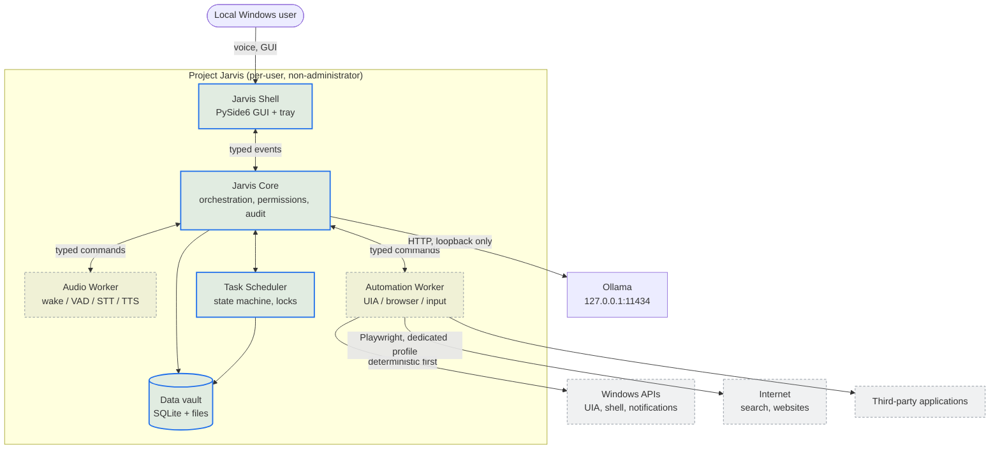
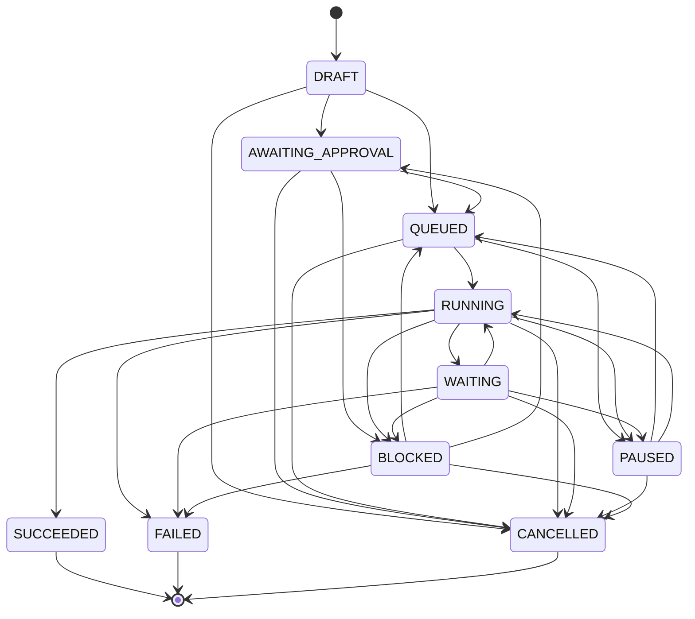
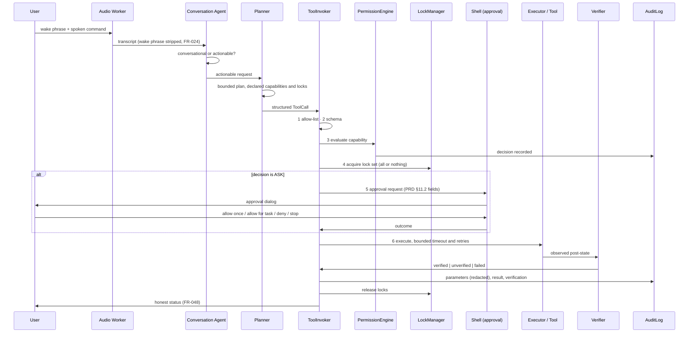

# Project Jarvis — Architecture

**Document version:** 1.0
**Status:** Phase 0 baseline
**Applies to:** Windows 11 x64, Python 3.11
**Companion documents:** [PRD.md](PRD.md), [SECURITY.md](SECURITY.md), [THREAT_MODEL.md](THREAT_MODEL.md), [DATA_MODEL.md](DATA_MODEL.md), [docs/BACKLOG.md](docs/BACKLOG.md), [docs/decisions/](docs/decisions/)

---

## 1. Purpose and scope

This document describes the runtime architecture of Project Jarvis: the process
and thread model, the module boundaries, the control flow that every
consequential action must pass through, and the extension points that later
phases plug into.

It describes the **target architecture** for Version 1. Where Phase 0 implements
only part of a component, the section says so explicitly. Section 12 is the
authoritative statement of what exists today.

This document does not restate the product requirements. It explains how the
requirements in [PRD.md](PRD.md) are structurally satisfied and records the
reasoning behind the boundaries.

---

## 2. Architectural drivers

Five requirements shape every decision below. They are listed in priority order,
and where they conflict, the higher one wins.

| # | Driver | Source | Structural consequence |
|---|--------|--------|------------------------|
| 1 | The agent must never obtain unrestricted computer control | PRD §6.1, §11.1, §13.3 | Capabilities are a closed, enumerated set. There is no generic execution primitive anywhere in the runtime, and none can be added without failing a build test. |
| 2 | Every consequential action is auditable, interruptible and attributable | PRD §1.8, §11.5 | A single choke point (`ToolInvoker`) mediates all tool execution. Nothing bypasses it. Every action carries a task ID. |
| 3 | Model output is untrusted input | PRD §11.4, §13.4 | The LLM emits structured tool-call proposals. Proposals are validated, permission-checked and lock-checked before execution. Free text is never executed. |
| 4 | The user interface must stay responsive | PRD NFR-003 | Audio, inference, automation and I/O run on worker threads. The Qt main thread only paints and dispatches. |
| 5 | Personal data stays local and is fully owned by the user | PRD §4.1, §14, NFR-025 | SQLite is the single source of truth, in a user-relocatable vault, with complete export and deletion. |

A sixth, softer driver: the architecture must survive the eventual replacement of
the Python shell by a native shell (ADR-0001). That is why every cross-component
message is a typed model rather than a Python object graph, and why
`JarvisCore` never imports Qt.

---

## 3. System context



Solid-bordered components exist in Phase 0. Dashed components are defined
interfaces with no implementation yet.

---

## 4. Process and thread model

### 4.1 Phase 0 through Phase 3: one process, many threads

Per PRD §12.2, the MVP runs the shell, core, scheduler and workers inside a
single Windows process. The separation is enforced by module boundaries and
typed messages rather than by process isolation, so that promoting a component
to its own process later requires no interface change.

```
Process: jarvis.exe  (per-user, asInvoker, single instance)
│
├── Thread: Qt main (GUI)            — QApplication event loop only
│     · tray icon, main window, approval dialogs
│     · receives domain events through EventBridge (queued Qt signals)
│     · MUST NOT block: no inference, no I/O, no automation
│
├── Thread: TaskScheduler            — dequeue, lock arbitration, run steps
├── Thread pool: task runners        — bounded, one step at a time per task
├── Thread: audio capture            — Phase 1, owned by sounddevice
│     · delivers 80 ms frames to VoicePipeline.push_frame
│     · NEVER touches a widget: callbacks emit Qt signals, delivered queued
├── Thread: conversation turn        — Phase 1, one QThread per turn
│     · the model call blocks; the worker is referenced until the thread ends
│     · awaited with a bound on quit — exiting with it running crashes natively
├── Threads: voice actions           — Phase 1, daemon, joined with a bound
│     · transcription, synthesis, calibration; all block for seconds
├── Thread: global hotkeys           — Win32 RegisterHotKey + GetMessageW
├── Thread: Automation Worker        — Phase 2
└── Thread: health / diagnostics     — periodic Ollama + vault checks
```

Two threading rules earned their place by being broken:

1. **A `QObject` moved to a `QThread` must be referenced for the thread's whole
   life.** It has no parent, so PySide6 destroys it as soon as the last Python
   reference goes; the thread then starts, emits `started`, and finds no
   receiver. Nothing raises and nothing is logged.
2. **The process must not exit with a `QThread` still running.** That is a
   native crash (`0xC0000409`), not an exception, so shutdown waits for it with
   a bound.

The rule that makes this safe is stated once and enforced everywhere:
**`jarvis.core`, `jarvis.tasks`, `jarvis.storage`, `jarvis.llm` and
`jarvis.config` must not import `PySide6`.** A unit test asserts this
(`tests/security/test_layering.py`). Consequently the whole engine is
importable and testable headlessly, and the GUI is a replaceable adapter.

### 4.2 Later phases: process separation

Two components are expected to become separate processes:

| Component | Trigger for separation | Interface today |
|-----------|------------------------|-----------------|
| Expressive TTS worker (Qwen3-TTS) | Requires Python 3.12 and CUDA; dependency set conflicts with the host (PRD FR-038) | `TtsProvider` protocol; will be backed by authenticated local IPC |
| Elevated action helper | Any action needing UAC elevation (PRD FR-004, FR-238) | Not yet defined; ADR-0009 |

Both follow PRD §12.3: named pipes or loopback only, per-installation
authentication token, no unauthenticated network port, token rotation on reset.

### 4.3 Concurrency invariants

1. Multiple tasks may run concurrently **only** when their resource-lock sets
   are disjoint (PRD §7.1, FR-124).
2. At most one task may hold `foreground_desktop` at any time. Others queue.
3. Lock acquisition is all-or-nothing to prevent deadlock: a task acquires its
   entire declared lock set in a canonical (sorted) order or acquires nothing.
4. Locks are persisted with an owning task ID and an owning runtime instance ID.
   On startup, locks owned by a dead instance are released and audited as stale.
5. Pause is cooperative and lands at the next declared checkpoint (PRD FR-125),
   never mid-action.

---

## 5. Layering

Dependencies point downward only. A test enforces this.

```
        ┌─────────────────────────────────────────────┐
  L5    │  jarvis.ui        (PySide6: tray, windows)  │
        └───────────────────┬─────────────────────────┘
        ┌───────────────────┴─────────────────────────┐
  L4    │  jarvis.runtime   (composition root)        │
        └───────────────────┬─────────────────────────┘
        ┌───────────────────┴─────────────────────────┐
  L3    │  jarvis.tasks    jarvis.llm    jarvis.audio │
        │  jarvis.toolbox  jarvis.automation          │
        └───────────────────┬─────────────────────────┘
        ┌───────────────────┴─────────────────────────┐
  L2    │  jarvis.core  (events, tools, permissions,  │
        │                audit, safety)               │
        └───────────────────┬─────────────────────────┘
        ┌───────────────────┴─────────────────────────┐
  L1    │  jarvis.storage  jarvis.config              │
        │  jarvis.diagnostics                         │
        └───────────────────┬─────────────────────────┘
        ┌───────────────────┴─────────────────────────┐
  L0    │  jarvis.common  (ids, UTC time, JSON)       │
        └─────────────────────────────────────────────┘
```

| Layer | May import | Must not import |
|-------|------------|-----------------|
| L0 common | stdlib | anything above |
| L1 storage, config, diagnostics | L0, pydantic, PyYAML | L2 and above |
| L2 core | L0, L1 | L3, L4, L5 |
| L3 capability modules | L0–L2 | L4, L5 |
| L4 runtime | L0–L3 | L5 |
| L5 ui, main | L0–L4 | — |

Two boundaries are worth spelling out, because they are the ones people break:

- **Only L5 may import `PySide6`.** `jarvis.main` is L5 and imports Qt lazily,
  inside a function, so `--check` runs with no display and no Qt loaded at all.
- **The tool *machinery* is L2; tool *implementations* are L3.**
  `jarvis.core.tools` holds the contract, registry and invoker;
  `jarvis.toolbox` holds the tools themselves, because an implementation may
  need a capability module (`jarvis.llm`, later `jarvis.automation`) that L2
  must not import. The invoker depends on the lock manager through a protocol in
  `jarvis.core.tools.ports`, never on `jarvis.tasks` directly.

`tests/security/test_layering.py` enforces both.

---

## 6. Core components

### 6.1 Configuration system (`jarvis.config`)

Three layers, merged deepest-first, then validated into one frozen pydantic
model tree:

```
config/defaults.yaml            (shipped, read-only, version-controlled)
   ↓ deep merge
%LOCALAPPDATA%\ProjectJarvis\config\user.yaml   (user overrides only)
   ↓ deep merge
JARVIS_* environment variables  (development and test overrides)
   ↓ validate
AppConfig  (pydantic, extra="forbid", schema_version pinned)
```

Design points:

- **Only overrides are persisted.** `user.yaml` contains the difference from
  defaults, so upgrading defaults changes behaviour for untouched settings and
  never silently reverts a user's choice.
- **`extra="forbid"` everywhere.** A typo in a settings key is a startup error
  with a precise path, not a silently ignored value.
- **Atomic writes.** Settings are written to a temporary file in the same
  directory and renamed, so a crash mid-save cannot corrupt configuration.
- **Path resolution is centralised** in `jarvis.config.paths.VaultPaths`.
  Windows environment variables (`%LOCALAPPDATA%`, `%USERPROFILE%`) are expanded
  there and nowhere else. `JARVIS_DATA_DIR` relocates the entire vault, which is
  how every test gets an isolated vault and how PRD §14.2 relocation is
  implemented.
- Changing a setting publishes `ConfigChanged`, so components react rather than
  re-read.

### 6.2 Typed event bus (`jarvis.core.events`)

An in-process publish/subscribe bus carrying frozen pydantic events.

- Every event derives from `Event` and carries `event_id`, `occurred_at`,
  `source`. Subclass matching means a subscriber to `Event` sees everything and
  a subscriber to `TaskStateChanged` sees only that.
- Publishing is thread-safe. Handlers run on the publishing thread; a handler
  that raises is logged and isolated, and never breaks the publisher or other
  subscribers. This matters because the audit log and the GUI both subscribe.
- The GUI never subscribes directly. `jarvis.ui.qt_bridge.EventBridge` subscribes
  once and re-emits as queued Qt signals, which is what moves events onto the Qt
  main thread safely.

The bus is deliberately *not* a message broker: it does not persist, retry or
order across threads. Anything requiring durability goes through the task store.

### 6.3 Audit log (`jarvis.core.audit`)

Dual-sink, append-only, redacted.

```
AuditEvent (pydantic)
   ├──> logs/audit.jsonl   append-only, one JSON object per line, fsync on write
   └──> SQLite audit_event  indexed, for search and GUI display
```

The JSONL file is the tamper-evident record; SQLite is the query index and is
rebuildable from it. Fields follow PRD §11.5 exactly: timestamp, task ID,
conversation ID, tool, redacted parameters, permission decision, pre-action
state, result, verification, error, evidence reference.

**Redaction happens before serialisation, not at display time.** `redaction.py`
walks the parameter tree and replaces values whose *key* matches a secret
pattern (`password`, `token`, `api_key`, `secret`, `cookie`, `authorization`,
`passphrase`, `private_key`, `credential`, `otp`) and values that *look* like
secrets (PEM blocks, bearer tokens, long high-entropy hex). Clipboard content is
never written to the audit log in plaintext (PRD FR-259) — only a length and a
content-class label. Oversized strings are truncated with an explicit marker so
a log entry can never be used to smuggle out a document.

### 6.4 Permission engine (`jarvis.core.permissions`)

The permission engine answers one question: *may this capability run, in this
scope, right now?* It never executes anything.

**Capability catalogue.** Every capability is declared once, with a risk level
drawn from PRD §11.1. The catalogue is data, not code, which makes the risk
classification directly testable against the PRD.

**Evaluation order** (short-circuits at the first decisive step):

1. Capability unknown → `DENY`. An unregistered capability is never implicitly
   permitted.
2. Risk is `PROHIBITED` → `DENY`, unconditionally, ignoring all grants. This
   path cannot be configured away.
3. Risk is `HIGH` → `ASK`, always. High-risk capabilities require fresh
   confirmation every time (PRD §11.1); persisted allow-grants for them are
   rejected at grant time, so no grant can reach this point.
4. A matching grant exists (same capability, compatible scope, matching scope
   reference, not expired, not revoked) → the grant's decision.
5. Otherwise → the configured default policy for that risk level (`ask` by
   default; `deny` in a hardened profile).

**Grant scopes** implement PRD §9.9: `ONCE`, `SESSION`, `TASK`, `APPLICATION`,
`FOLDER`, `ALWAYS`. `ALWAYS` is accepted only for `LOW` risk. Folder grants
match by canonical path prefix, so a grant on `…\Documents\Jarvis Workspace`
covers its children and nothing else.

Every evaluation, grant, revocation and expiry writes an audit event and
publishes `PermissionDecided`. There is no silent path.

### 6.5 Tool contract and registry (`jarvis.core.tools`)

A **tool** is the only way the agent affects anything. The contract is PRD
§13.2, expressed as a pydantic `ToolSpec`: tool ID, version, description, input
and output schemas, risk category, required capabilities, resource locks,
timeout, retry policy, whether it changes state, verification method, redaction
rules, supported applications, failure codes, and reversibility metadata (PRD
FR-221).

Two guards sit on registration:

- **Denylist by identity.** Every tool name from PRD §13.3 "Prohibited broad
  tools" is rejected outright.
- **Denylist by pattern.** Names matching `shell`, `powershell`, `cmd`,
  `terminal`, `wsl`, `exec`, `eval`, `subprocess`, `arbitrary`, `registry_write`
  and similar are rejected, so a future contributor cannot introduce
  `run_shell_v2`.

These are belt and braces. The real guarantee is that no such implementation
exists: `tests/security/test_no_shell.py` scans the entire `src/` tree for
`subprocess`, `os.system`, `os.popen`, `eval(`, `exec(`, `shell=True`,
`ShellExecute` and `CreateProcess`, and fails the build if any appears. Phase 1
will need `os.startfile` to launch approved applications; that will be
introduced through a single reviewed, allow-listed call site recorded in an ADR,
not by weakening the test.

### 6.6 Tool invoker (`jarvis.core.tools.invoker`)

The single choke point. PRD §13.4 requires six checks before any model-proposed
action runs; the invoker performs them in this order, and each failure is
audited with the reason:

```
   ToolCall (from planner, GUI, skill or schedule)
        │
   1. Allow-list          registry lookup; unknown tool → reject
   2. Schema validation   parameters parsed into the tool's pydantic input model
   3. Permission          PermissionEngine.evaluate(capability, scope, target)
   4. Resource locks      all-or-nothing acquisition of the declared lock set
   5. Approval            if decision is ASK, ApprovalPort presents PRD §11.2 dialog
   6. Execute             bounded timeout, bounded retries, audited before and after
        │
   ToolResult  (typed; success is only asserted after the declared verification)
```

Notes that matter:

- **Order is deliberate.** Schema validation precedes permission evaluation so
  the approval dialog can show validated, concrete parameters rather than raw
  model output. Locks are acquired before approval so a user is not asked to
  approve something that will then queue behind another task.
- **`ApprovalPort` is an interface, not the GUI.** The core asks; the shell
  answers. In headless and test contexts the port is a policy object. Phase 0
  ships a `DenyingApprovalPort` as the default: if nothing is wired to ask the
  user, the answer is no. Silence is never consent.
- **Failure is explicit.** `ToolResult` distinguishes `succeeded`,
  `failed`, `denied`, `blocked`, `timed_out` and `cancelled`, each with a failure
  code from the tool's declared set. There is no boolean "worked".
- **Verification is part of the tool, not the caller** (PRD FR-048, AT-018). A
  tool that cannot verify its own effect reports `unverified`, and the task
  layer treats that as not-succeeded.

### 6.7 Task subsystem (`jarvis.tasks`)

Four collaborating pieces, all persisted.

**State machine** (`states.py`). The ten states of PRD FR-122 with an explicit
transition table. Every transition is validated; an illegal transition raises
rather than silently correcting. Terminal states (`SUCCEEDED`, `FAILED`,
`CANCELLED`) have no outgoing edges.



**Task store** (`store.py`). SQLite-backed. Transitions are written inside a
transaction together with their audit event, so the log and the state cannot
disagree. Tasks carry a parent ID (task trees, PRD FR-121), a retry count and
limit (FR-133), a declared lock set, an evidence collection (FR-132) and a
`recovered` marker.

**Resource locks** (`locks.py`). Named, exclusive, persisted, owner-attributed.
The Phase 0 namespace follows PRD FR-124: `foreground_desktop`,
`browser_profile:<name>`, `microphone_capture`, `speaker_output`, `clipboard`,
`application:<id>`, `folder_scope:<canonical path>`,
`network_connector:<id>`. Acquisition is all-or-nothing over a sorted lock set.
A held lock records the runtime instance ID; startup reclaims locks whose owner
instance is gone.

**Scheduler** (`scheduler.py`). A single background thread that repeatedly:
selects `QUEUED` tasks by priority then age, attempts lock acquisition, and
dispatches acquirable tasks to a bounded runner pool. Tasks whose locks are
unavailable stay `QUEUED` with a visible `waiting_on` reason — this is what makes
PRD AT-009 ("one runs, the other remains queued") an observable property rather
than an emergent accident. Cancellation and pause are cooperative: the runner
checks a per-task control flag at declared checkpoints.

**Crash recovery** (PRD FR-006, NFR-010, NFR-011, AT-011). On startup:
`RUNNING` and `WAITING` tasks from a previous instance transition to `PAUSED`
with `recovered=true` and `blocked_reason="interrupted_by_restart"`. They are
never auto-resumed, because resuming blindly could repeat a consequential
external action. Stale locks are released. Every recovery decision is audited.

### 6.8 Model routing and the LLM boundary (`jarvis.llm`)

Phase 0 implements only the health check; the boundary is defined now so later
phases have somewhere to land.

- **Ollama is reached over loopback only.** The health checker rejects a
  configured base URL whose host is not a loopback address, and audits the
  refusal. A remote "local" endpoint would silently ship every prompt off the
  machine.
- **Offline mode is honoured at the boundary**, not by the caller. In `offline`
  network mode the health check does not open a socket; it returns
  `skipped(reason="offline_mode")`. PRD AT-001 is therefore a property of the
  adapter, not of caller discipline.
- **Model roles are separate** (PRD FR-041): planner, vision, embeddings, STT,
  TTS. Each role names a profile in configuration; nothing hard-codes a model
  name. The resource scheduler (PRD FR-039) that prevents two heavy models
  loading at once is a Phase 1/4 concern and is stubbed as configuration today
  (`model_runtime.load_strategy: sequential`).
- **Structured output only.** When the planner is implemented, it will emit tool
  calls against JSON schemas generated from `ToolSpec.input_schema`. Free-form
  text is a conversational response and can never reach the invoker.

### 6.9 Runtime composition (`jarvis.runtime`)

`JarvisCore` is the composition root and owns startup and shutdown ordering. It
imports no GUI code.

```
start():
  1. resolve VaultPaths, create directories
  2. load and validate configuration
  3. open SQLite, apply migrations, verify schema version
  4. construct EventBus, AuditLog
  5. construct PermissionEngine, ToolRegistry, ToolInvoker
  6. construct TaskStore, LockManager, TaskScheduler
  7. run crash recovery (tasks + stale locks)
  8. register Phase 0 tools
  9. start workers and scheduler
 10. publish AppStarted

shutdown():   (reverse, and idempotent)
  1. publish AppStopping
  2. stop scheduler, wait for in-flight steps to reach a checkpoint
  3. stop workers with timeout, then force
  4. release all locks owned by this instance
  5. flush audit log, checkpoint SQLite WAL
  6. release the single-instance handle
```

Shutdown is also the emergency-stop path's tail: emergency stop (PRD §11.3)
cancels running tasks, releases every lock, halts workers and publishes
`EmergencyStopCompleted` with a list of exactly what was stopped, but leaves the
process running.

**Single instance** (PRD FR-005) uses a Windows named mutex acquired at startup
(`Local\ProjectJarvis.SingleInstance`, per-session by design so it constrains one
interactive session as the PRD requires). A lock-file fallback exists for
non-Windows development hosts so the test suite is portable.

### 6.10 Shell and tray (`jarvis.ui`)

PySide6. Deliberately thin: it renders state and collects user decisions.

- **Tray icon** with the seven states of PRD §9.1. Colour is never the only
  signal — each state also sets a tooltip and an accessible name (PRD NFR-033).
  Icons are drawn programmatically with `QPainter` rather than shipped as
  assets, which sidesteps the asset-licensing constraint in PRD §17.3 until an
  original icon set exists.
- **Tray menu** per PRD §9.2. Items whose feature does not exist yet are
  present but **disabled with an explanatory tooltip naming the phase**. They are
  not hidden (so the shape of the product is visible) and not fake (so nothing
  reports success it did not achieve).
- **Main window** with the fifteen navigation areas of PRD §9.3. Phase 0
  implements Home, Tasks, Permissions, Audit log, Settings and About against
  live data. The remaining areas render an honest "not implemented, Phase N"
  panel.
- **EventBridge** converts domain events to queued Qt signals. This is the only
  place where the domain and Qt threading models meet.

---

## 7. Control flow: a request end to end

This is the path every future feature follows. Phase 0 implements the shaded
portion; the rest is defined but not built.



Two properties are worth naming explicitly:

- The planner cannot skip the invoker, because tools are not callable objects
  handed to the model — the model emits a name and a parameter object, and only
  the invoker can resolve a name to an implementation.
- Untrusted content (web pages, documents, UI text) enters as *observations*
  attached to the task, wrapped in delimiters and never concatenated into the
  instruction region of a prompt (PRD §11.4). An observation can inform a plan;
  it can never authorise a capability.

---

## 8. Extension points

| Extension point | Interface | First consumer | Phase |
|-----------------|-----------|----------------|-------|
| Tool | `ToolSpec` + `Tool.run(ctx, params)` | `system.health` | 0 |
| Approval | `ApprovalPort.request(spec) -> ApprovalOutcome` | Qt approval dialog | 1 |
| TTS provider | `TtsProvider.speak(text, style) -> audio` | Kokoro, SAPI fallback, Qwen3-TTS worker | 1 |
| STT provider | `SttProvider.transcribe(audio) -> Transcript` | faster-whisper | 1 |
| Wake detector | `WakeDetector.stream(frames) -> WakeEvent` | openWakeWord | 1 |
| LLM provider | `ChatProvider.complete(messages, tools) -> Response` | Ollama | 1 |
| Application adapter | `AppAdapter` (launch, verify, close, actions) | Brave, YouTube, Xbox, Antigravity | 2, 5 |
| Automation backend | `UiBackend` (find, invoke, read, capture) | UIA, Playwright DOM, vision | 2, 4 |
| Task runner | `TaskRunner.step(ctx) -> StepOutcome` | health check task | 0 |
| Skill | `SkillManifest` + `workflow.json` | macro recorder | 3 |
| Secret store | `SecretStore.get/set/delete` | DPAPI-backed store | 1 |

Adapters are in-process today. Whether they become isolated plugins is an open
decision (ADR-0010).

---

## 9. Data architecture summary

Full detail is in [DATA_MODEL.md](DATA_MODEL.md). The architectural points:

- **SQLite (`jarvis.db`) is the single source of truth** for transactional
  state. Everything else — the embedding index, the file index, caches — is
  derived and rebuildable, and must never hold unique information (PRD §14.1).
- **WAL mode, foreign keys on, one connection per thread.** WAL gives concurrent
  readers alongside the scheduler's writer; foreign keys are what make cascade
  deletion of derived data correct (PRD FR-167).
- **Versioned forward migrations** with an explicit registry and a recorded
  applied-at timestamp. The schema version is checked at startup; a database
  newer than the running binary is a hard startup failure rather than a
  best-effort read (PRD NFR-043).
- **Large or binary artefacts live on disk**, referenced by path from the
  database: screenshots, audio diagnostics, task evidence, exports, backups.
- **The vault is relocatable** and fully deletable (PRD §14.2, NFR-025).

---

## 10. Error handling, timeouts and honesty

- Every external interaction declares a timeout (PRD NFR-013). There is no
  unbounded `wait`.
- Every retry loop declares a maximum and exposes the current attempt (PRD
  FR-133, NFR-012). `RetryPolicy` is part of `ToolSpec`, not ad-hoc in call
  sites.
- Failures are typed. Tools declare their failure codes; the invoker rejects a
  result carrying an undeclared code, which stops a tool from inventing a
  vague error.
- **Success requires verification.** A step is `succeeded` only when its declared
  verification passed. `unverified` is a distinct outcome and does not satisfy a
  task's success criteria (PRD FR-048, AT-018).
- Graceful degradation is explicit (PRD NFR-014): when a provider is
  unavailable, the affected capability reports the limitation and the offered
  fallback, and the tray shows a degraded state. It does not pretend.

---

## 11. Testing architecture

| Suite | Location | Purpose | Runs in CI |
|-------|----------|---------|------------|
| Unit | `tests/unit/` | Pure logic: permissions, transitions, locks, redaction, config merge | Yes |
| Security | `tests/security/` | Structural invariants: no shell primitives, no prohibited tools, layering, no elevation manifest | Yes |
| Integration | `tests/integration/` | Core lifecycle, migrations, crash recovery, audit durability | Yes |
| UI | `tests/ui/` | Qt tray and window under `QT_QPA_PLATFORM=offscreen` | Yes |
| Acceptance | `tests/acceptance/` | One test per Phase 0 exit criterion from PRD §21 | Yes |

Every test gets an isolated vault through the `JARVIS_DATA_DIR` override, so no
test touches the real `%LOCALAPPDATA%`. Tests never require Ollama, a
microphone, a GPU or the network; external dependencies are injected as fakes at
their protocol boundary.

The security suite is the load-bearing one. It encodes constraints that must
hold for the lifetime of the project, and it fails the build rather than
producing a warning.

---

## 12. What exists today

Phase 0 was foundation and safety architecture only. Phase 1 has since added the
approval dialog, the secret store, conversation, the voice stack and the six
approved tools. There is still **no general desktop or browser automation**: no
filesystem tools, no screen capture, no clipboard access, and no input synthesis
beyond the fixed media-key table. Launching an approved application goes through
the single call site ADR-0029 authorises.

| Component | Status | Notes |
|-----------|--------|-------|
| Layered typed configuration | Implemented | defaults + user overrides + env, `extra="forbid"`, atomic save |
| Vault path resolution | Implemented | `%LOCALAPPDATA%` expansion, relocatable, `JARVIS_DATA_DIR` |
| SQLite storage + migrations | Implemented | WAL, foreign keys, versioned forward migrations |
| Typed event bus | Implemented | thread-safe, subclass matching, handler isolation |
| Audit log | Implemented | JSONL + SQLite, PRD §11.5 fields, redaction |
| Secret redaction | Implemented | key patterns, value patterns, truncation |
| Capability catalogue | Implemented | PRD §11.1 risk classification as data |
| Permission engine | Implemented | evaluation order, scopes, expiry, revocation, no always-allow for high risk |
| Tool contract | Implemented | PRD §13.2 fields as `ToolSpec` |
| Tool registry + prohibited guard | Implemented | denylist by identity and by pattern |
| Tool invoker | Implemented | the six-step pipeline, timeouts, bounded retries |
| Task state machine | Implemented | ten states, validated transitions |
| Task store | Implemented | persisted tasks, steps, checkpoints, evidence |
| Resource locks | Implemented | exclusive, persisted, all-or-nothing, stale reclamation |
| Task scheduler | Implemented | queue, lock gating, cooperative pause/cancel, bounded retry |
| Crash recovery | Implemented | interrupted tasks to `PAUSED`, stale locks released |
| Worker threads | Implemented | supervised, graceful stop, off the UI thread |
| Ollama health check | Implemented | loopback-only, offline-mode aware, timeout |
| Single-instance guard | Implemented | named mutex, lock-file fallback |
| Emergency stop | Implemented | cancels tasks, releases locks, reports what stopped |
| PySide6 tray + main window | Implemented | seven states, PRD §9.2 menu, nine live nav areas |
| Approval dialog + queue | Implemented (Phase 1) | tray-anchored, non-modal, timeout-as-denied, scoped rememberable denials (ADR-0027) |
| Secret store | Implemented (Phase 1) | DPAPI, unencrypted metadata beside the ciphertext (ADR-0030) |
| Global hotkeys, start at sign-in | Implemented (Phase 1) | `RegisterHotKey` on its own message loop; per-user `Run` key, never elevated |
| Conversation, model routing, grounding | Implemented (Phase 1) | structured tool calls only; five FR-047 source labels; FR-048 enforced on the way out |
| History and private sessions | Implemented (Phase 1) | a private session writes nothing at all; `secure_delete` makes deletion real |
| Personality profile and proposals | Implemented (Phase 1) | user-editable; a proposal changes nothing until accepted (§4.4) |
| Voice: capture, ring buffer, VAD, STT, TTS, barge-in | Implemented (Phase 1) | optional `voice` extra, lazily imported; verified on this hardware |
| Audio playback (`jarvis.audio.playback`) | Implemented (Phase 1) | interruptible between 40 ms blocks, bounded at 300 s, reports seconds actually written. Previously absent, which made every "Spoken." claim false |
| Audio cues (`jarvis.audio.cues`) | Implemented (Phase 1) | four generated sine tones — wake, thinking, done, failed — so a tray application is legible without its window. Nothing is shipped as a file, so nothing can go missing or need a licence |
| Spoken-reply policy (`jarvis.audio.reply_policy`) | Implemented (Phase 1) | decides speak / cue / silent from the request, the reply and the tool results. In code, not asked of the model: a model deciding whether to speak drifts, and the drift is invisible |
| Speech text preparation (`jarvis.audio.tts.speakable_text`) | Implemented (Phase 1) | strips emoji, markdown and URL machinery before synthesis, and runs **before** redaction so formatting cannot hide a credential from the FR-034 patterns. Presentation only — it removes no words, and the transcript is untouched |
| Voice ↔ shell wiring (`jarvis.ui.voice_controller`) | Implemented (Phase 1) | push-to-talk, level meter, recording indicator, device choice, mic test, calibration, preview |
| Wake-word base model | Implemented (Phase 1) | openWakeWord `hey_jarvis` ONNX, installed via `--install-wake-model`, never bundled; non-commercial licence |
| Per-user wake enrolment | Not implemented | ADR-0016 Path 1; always-listening stays off without it, and the button is disabled and says so |
| Application launcher, browser, media, volume, speak, notify tools | Implemented (Phase 1) | six narrow typed tools; the launcher is the one call site ADR-0029 authorises |
| Automation, vision, memory, skills | Not implemented | Phases 2–4 |

---

## 13. Known architectural gaps

Recorded here so they are not discovered late. Each has a backlog entry, and the
contested ones have an ADR.

1. **The Ollama endpoint is unauthenticated by design.** Any local process can
   reach it. Jarvis cannot fix that; it can only avoid trusting it (ADR-0007).
2. **In-process isolation is not a security boundary.** In Phases 0–3 a defect in
   the automation worker can reach the vault. Process separation is deferred
   (ADR-0004).
3. ~~**The approval path has no UI yet.**~~ Closed in Phase 1: the dialog and its
   queue exist (ADR-0027). The residual risk moved rather than disappearing — a
   non-modal surface can be missed, so visibility now depends on the tray state,
   the notification, the window list and the timeout all working.
4. **Untrusted-content wrapping is specified but unexercised** — nothing produces
   untrusted content yet. The delimiter strategy needs adversarial testing when
   the first content source lands (Phase 2).
5. **`ALWAYS` grants have no automatic review.** A low-risk always-allow granted
   once persists indefinitely; a periodic review prompt is a Phase 3 item.
6. **Model-resource scheduling was configuration only.** `ModelRouter.hold` now
   refuses a second heavy role while one is held, so `sequential` is enforced
   rather than declared. It is still not meaningfully exercised until Phase 4
   adds the vision model, which is why the lease is deliberately simple.

7. **Self-trigger rates for barge-in have not been measured** on real hardware.
   ADR-0028 makes that measurement the gate on relying on barge-in, and the
   hooks exist (`DuplexCoordinator.measurement_summary`), but the tuning
   exercise has not been done. Until it is, push-to-talk is the dependable
   interruption path.

8. **No wake-word model is present.** Everything around detection is built and
   reports its absence honestly. Obtaining the base model carries the PRD §17.2
   disclosure obligations (provider, licence, size, install location).

---

## 14. Change control

- Any change to the risk classification of a capability requires an ADR.
- Any addition to the tool denylist exemptions requires an ADR and a named
  reviewer.
- Any new import of `PySide6` outside `jarvis.ui` fails `tests/security/`.
- Any new use of a process-creation or dynamic-evaluation primitive fails
  `tests/security/test_no_shell.py`. Lifting that requires an ADR that names the
  exact call site and its justification.
- This document is reviewed at every phase gate; §12 must be accurate before a
  phase is declared complete.
