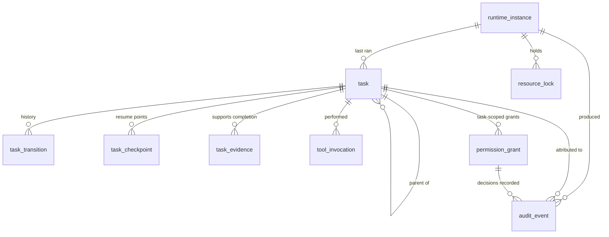

# Project Jarvis — Data Model

**Document version:** 1.0
**Status:** Phase 0 baseline (schema version 1)
**Canonical store:** `%LOCALAPPDATA%\ProjectJarvis\data\jarvis.db`
**Companion documents:** [ARCHITECTURE.md](ARCHITECTURE.md), [SECURITY.md](SECURITY.md), [THREAT_MODEL.md](THREAT_MODEL.md), [docs/decisions/ADR-0002-sqlite-single-source-of-truth.md](docs/decisions/ADR-0002-sqlite-single-source-of-truth.md)

---

## 1. Principles

Five rules govern every table in this document.

1. **SQLite is the single source of truth** for transactional state (PRD
   section 14.1). Everything else — embedding indexes, file indexes, caches —
   is derived, rebuildable, and must contain no unique information.
2. **The user owns the data.** Every user-owned record is exportable to a
   human-readable form, and all local data is deletable (PRD NFR-025).
3. **Large or binary artefacts live on disk**, referenced by path. Screenshots,
   audio diagnostics, task evidence and exports never become BLOBs.
4. **Timestamps are ISO-8601 UTC strings.** SQLite has no native datetime;
   text keeps the database inspectable with any tool and sorts correctly.
5. **Identifiers are UUID4 hex**, 32 characters, generated by
   `jarvis.common.new_id`. They are opaque and carry no meaning.

### Conventions

| Convention | Rule |
|------------|------|
| Table names | singular, `snake_case` (`task`, not `tasks`) |
| Primary keys | `<entity>_id TEXT PRIMARY KEY` |
| Timestamps | `TEXT NOT NULL`, ISO-8601 with offset |
| Booleans | `INTEGER NOT NULL` holding 0 or 1 |
| Structured values | `<name>_json TEXT`, deterministic JSON (sorted keys) |
| Foreign keys | declared and enforced (`PRAGMA foreign_keys = ON`) |

---

## 2. Storage layout

```text
%LOCALAPPDATA%\ProjectJarvis\
├── config/
│   └── user.yaml              overrides only; defaults ship with the app
├── data/
│   └── jarvis.db              canonical transactional store  ← this document
├── logs/
│   ├── app.log                diagnostic logging (rotating)
│   ├── audit.jsonl            append-only audit record of truth
│   └── crashes/
├── attachments/
│   ├── screenshots/           Phase 2+
│   ├── audio_diagnostics/     Phase 1+, opt-in only
│   └── task_evidence/
├── browser/                   Phase 2: dedicated automation profile
├── models/                    wake words, voices, metadata
├── exports/                   .jarvispack and audit exports
├── backups/                   pre-modification copies (Phase 3)
├── temp/
└── runtime/                   single-instance lock
```

The vault relocates wholesale via `--data-dir` or `JARVIS_DATA_DIR` (PRD section
14.2). `jarvis.config.paths.VaultPaths` is the only code that resolves any of
these paths.

### Two audit sinks, one record of truth

`logs/audit.jsonl` is the tamper-evident record; the `audit_event` table is a
search index over it. If the index is lost, it can be rebuilt from the file. If
the file is lost, history is gone — which is why the file is written first and a
SQLite failure degrades search rather than losing the entry.

---

## 3. Schema version 1 — the tables as built

Full DDL lives in `src/jarvis/storage/migrations.py`. Migration 1 is
`phase0_foundation`.

### 3.1 `schema_migration`

Records what has been applied. `PRAGMA user_version` holds the same number and
is what startup checks.

| Column | Type | Notes |
|--------|------|-------|
| `version` | INTEGER PK | monotonically increasing |
| `name` | TEXT | e.g. `phase0_foundation` |
| `applied_at` | TEXT | when it ran on this machine |

### 3.2 `runtime_instance`

One row per application launch. This is what makes crash detection possible: an
instance with `stopped_at IS NULL` that is not the current one died.

| Column | Type | Notes |
|--------|------|-------|
| `instance_id` | TEXT PK | |
| `pid` | INTEGER | operating-system process id |
| `app_version` | TEXT | |
| `started_at` | TEXT | |
| `stopped_at` | TEXT NULL | `NULL` means it never shut down cleanly |

### 3.3 `audit_event`

The search index over `audit.jsonl`. Field set is PRD section 11.5 exactly.

| Column | Type | Notes |
|--------|------|-------|
| `audit_id` | TEXT PK | |
| `occurred_at` | TEXT | indexed |
| `instance_id` | TEXT NULL | which launch produced it |
| `category` | TEXT | `lifecycle`, `config`, `permission`, `tool`, `task`, `lock`, `security`, `health`, `recovery`, `data` |
| `actor` | TEXT | `user`, `system`, `planner`, `schedule`, `recovery` |
| `task_id` | TEXT NULL | indexed; attributes the action to a task |
| `conversation_id` | TEXT NULL | |
| `tool_id` | TEXT NULL | |
| `capability_id` | TEXT NULL | indexed |
| `risk` | TEXT NULL | |
| `permission_decision` | TEXT NULL | `allow`, `ask`, `deny`, `revoked` |
| `summary` | TEXT | one human-readable line, never contains secrets |
| `parameters_json` | TEXT NULL | **already redacted** |
| `pre_state_json` | TEXT NULL | **already redacted** |
| `result` | TEXT NULL | |
| `verification` | TEXT NULL | |
| `error` | TEXT NULL | |
| `evidence_ref` | TEXT NULL | path or reference, never inline content |

Redaction happens before serialisation, in `jarvis.core.audit.redaction` — by
field name, by value shape, and by content class for clipboard, transcript and
document text (PRD FR-259). Nothing downstream has to remember.

### 3.4 `permission_grant`

A recorded decision that may apply to future requests. **Absence of a row is
never permission**: no grant means ask or deny, decided by policy.

| Column | Type | Notes |
|--------|------|-------|
| `grant_id` | TEXT PK | |
| `capability_id` | TEXT | indexed; must exist in the catalogue |
| `decision` | TEXT | `allow` or `deny` |
| `scope` | TEXT | `once`, `session`, `task`, `application`, `folder`, `always` |
| `scope_ref` | TEXT NULL | application id or canonical folder path |
| `session_id` | TEXT NULL | required for `session` scope |
| `task_id` | TEXT NULL | required for `task` scope |
| `created_at` | TEXT | |
| `created_by` | TEXT | `user`, `system_default`, `import` |
| `expires_at` | TEXT NULL | session grants get a TTL |
| `revoked_at` | TEXT NULL | set on revocation and on consuming a `once` grant |
| `reason` | TEXT NULL | shown in the Permissions screen |

Invariants enforced by `PermissionEngine.grant`, not only by convention:

- a `prohibited`-risk capability can never be granted at all;
- a `high`-risk capability may only be *allowed* with scope `once`;
- `always` allow is available to `low` risk only;
- `application` and `folder` scopes require a `scope_ref`, `session` a
  `session_id`, `task` a `task_id`.

Grant rows are never deleted. Revocation sets `revoked_at`, so the history of
what was permitted remains auditable.

### 3.5 `task`

The durable state machine (PRD FR-120 … FR-133).

| Column | Type | Notes |
|--------|------|-------|
| `task_id` | TEXT PK | |
| `parent_task_id` | TEXT NULL FK → `task` | `ON DELETE CASCADE`; task trees (FR-121) |
| `conversation_id` | TEXT NULL | |
| `name`, `goal` | TEXT | shown in the Tasks screen |
| `runner_id` | TEXT | which registered runner executes it |
| `state` | TEXT | indexed; one of the ten states |
| `priority` | INTEGER | lower runs first; default 100 |
| `required_locks_json` | TEXT | the declared lock set |
| `payload_json` | TEXT | runner input |
| `attempts` | INTEGER | dispatch count, including the first |
| `max_retries` | INTEGER | the bound (FR-133) |
| `waiting_on` | TEXT NULL | user-visible reason it is not progressing |
| `blocked_reason` | TEXT NULL | |
| `failure_code` | TEXT NULL | |
| `result_summary` | TEXT NULL | |
| `recovered` | INTEGER | 1 when a restart moved it out of an interrupted state |
| `instance_id` | TEXT NULL | indexed; which launch last ran it |
| `created_at`, `updated_at` | TEXT | |
| `started_at`, `ended_at` | TEXT NULL | |

**States** (PRD FR-122): `draft`, `awaiting_approval`, `queued`, `running`,
`waiting`, `paused`, `blocked`, `succeeded`, `failed`, `cancelled`. Transitions
are validated against an explicit table in `jarvis.tasks.states`; terminal states
have no outgoing edges, so recovery can never silently re-run finished work.

### 3.6 `task_transition`

Every state change, in order. Written in the same transaction as the state
change itself, so the log and the state cannot disagree.

| Column | Type | Notes |
|--------|------|-------|
| `transition_id` | TEXT PK | |
| `task_id` | TEXT FK → `task` | `ON DELETE CASCADE`, indexed with `occurred_at` |
| `from_state` | TEXT NULL | `NULL` on creation |
| `to_state` | TEXT | |
| `reason` | TEXT NULL | |
| `occurred_at` | TEXT | |

### 3.7 `task_checkpoint`

Durable resume points (PRD FR-128). `UNIQUE (task_id, sequence)` keeps them
ordered and idempotent.

| Column | Type | Notes |
|--------|------|-------|
| `checkpoint_id` | TEXT PK | |
| `task_id` | TEXT FK → `task` | `ON DELETE CASCADE` |
| `sequence` | INTEGER | 0-based, per task |
| `label` | TEXT | what the runner had reached |
| `state_json` | TEXT | enough to resume from |
| `created_at` | TEXT | |

### 3.8 `task_evidence`

Support for a completion claim (PRD FR-132, FR-048). A task is not "succeeded"
because something was clicked; it is succeeded because this table says why.

| Column | Type | Notes |
|--------|------|-------|
| `evidence_id` | TEXT PK | |
| `task_id` | TEXT FK → `task` | `ON DELETE CASCADE`, indexed |
| `kind` | TEXT | `window_title`, `process_state`, `file_exists`, `ui_text`, `screenshot`, `test_result`, `browser_state`, `user_confirmation`, `tool_result` |
| `summary` | TEXT | |
| `detail_json` | TEXT NULL | |
| `artefact_path` | TEXT NULL | points into `attachments/`; content is never inlined |
| `created_at` | TEXT | |

### 3.9 `resource_lock`

Exclusive resource ownership (PRD FR-124). **The primary key is the mutual
exclusion**: one row per lock name, or no row. There is no separate locking
protocol to get wrong.

| Column | Type | Notes |
|--------|------|-------|
| `lock_name` | TEXT PK | |
| `task_id` | TEXT | the owner |
| `instance_id` | TEXT | which launch holds it — this is what makes stale locks identifiable |
| `acquired_at` | TEXT | |

Namespace: `foreground_desktop`, `browser_profile:<name>`,
`microphone_capture`, `speaker_output`, `clipboard`, `application:<id>`,
`folder_scope:<canonical path>`, `network_connector:<id>`. Unknown names are
rejected at acquisition.

Acquisition is all-or-nothing over a canonically sorted set, which is what stops
two tasks deadlocking by taking the same locks in different orders. On startup,
locks owned by a dead instance are released and audited.

### 3.10 `tool_invocation`

One row per execution attempt, feeding the metrics in PRD section 24.

| Column | Type | Notes |
|--------|------|-------|
| `invocation_id` | TEXT PK | |
| `tool_id`, `tool_version` | TEXT | indexed with `started_at` |
| `task_id` | TEXT NULL | indexed |
| `outcome` | TEXT | `succeeded`, `failed`, `denied`, `blocked`, `timed_out`, `cancelled` |
| `failure_code` | TEXT NULL | must be one the tool declared |
| `verification` | TEXT | `verified`, `unverified`, `failed`, `not_applicable` |
| `attempts` | INTEGER | |
| `started_at`, `ended_at` | TEXT | |
| `duration_ms` | INTEGER | |

`outcome` and `verification` are separate on purpose. A tool that ran but could
not confirm its effect is `succeeded` + `unverified`, which does **not** satisfy
a task's success criteria (PRD FR-048, AT-018).

---

## 4. Entity relationships



Only `task → task`, `task → task_transition`, `task → task_checkpoint` and
`task → task_evidence` are enforced foreign keys with cascade. The rest are soft
references: an audit record must survive the deletion of the task it describes,
otherwise deleting a task would erase the evidence of what it did.

---

## 5. Typed models

Every persisted entity has a frozen pydantic model. The database is the
persistence format; these are the contract.

| Model | Module | Table |
|-------|--------|-------|
| `AppConfig` and its tree | `jarvis.config.schema` | `config/user.yaml` |
| `AuditEvent` | `jarvis.core.audit.models` | `audit_event` |
| `Capability` | `jarvis.core.permissions.models` | in-code catalogue |
| `PermissionGrant` | `jarvis.core.permissions.models` | `permission_grant` |
| `PermissionRequest`, `PermissionEvaluation` | `jarvis.core.permissions.models` | not persisted |
| `ToolSpec` | `jarvis.core.tools.contract` | in-code registry |
| `ToolResult` | `jarvis.core.tools.contract` | `tool_invocation` |
| `Task` | `jarvis.tasks.models` | `task` |
| `TaskTransition` | `jarvis.tasks.models` | `task_transition` |
| `TaskCheckpoint` | `jarvis.tasks.models` | `task_checkpoint` |
| `TaskEvidence` | `jarvis.tasks.models` | `task_evidence` |
| `ResourceLockRecord` | `jarvis.tasks.models` | `resource_lock` |
| `Event` and subclasses | `jarvis.core.events.types` | not persisted |

The capability catalogue and the tool registry are deliberately **code, not
data**. A capability that could be added by editing a row would be a capability
that could be added without review.

---

## 6. Entities defined but not yet built

PRD section 14.3 lists the full Version 1 entity set. Phase 0 implements the
subset above. The rest arrive with the capability that needs them — declaring a
table before anything writes to it would be speculative schema.

| Entity group | Phase | Notes |
|--------------|-------|-------|
| Conversation, message, personality profile | 1 | history controls and private session (FR-045, FR-046) |
| Model profile, voice profile, token usage | 1 | role-based model routing (FR-041) |
| Application, application alias | 2 | the application catalogue (FR-060) |
| Window layout, monitor profile, workspace profile and version | 3 | FR-240 … FR-249, FR-280 … FR-289 |
| Memory, memory source | 3 | candidate → approval pipeline; never silent (FR-160 … FR-165) |
| Skill, skill version, workflow step, skill usage | 3 | recorded macros (FR-100 … FR-110) |
| File alias, file index scope, indexed file record | 3 | approved-scope indexing (FR-201, FR-206) |
| File-operation record, reversible action, backup, recovery record | 3 | undo and the recovery centre (FR-220 … FR-229) |
| Clipboard item, clipboard exclusion | 3 | FR-250 … FR-259 |
| Schedule, schedule run, conditional trigger | 3 | FR-290 … FR-299 |
| Folder watcher, application watcher | 4 | FR-203, FR-291 |
| Notification rule, notification event | 4 | FR-260 … FR-269 |
| Document extraction, document citation, derived summary | 4 | FR-210 … FR-219 |
| Captured screenshot | 4 | retention per ADR-0025 |
| Integration | 6 | user-supplied provider configuration |
| Export package, export manifest | 3 | `.jarvispack` (PRD section 14.6) |

---

## 7. Migrations

Forward-only, append-only, transactional.

- Each migration has an integer `version`, a `name` and its DDL. Released
  migrations are **never edited**; a correction is a new migration.
- Statements execute one at a time inside a single transaction, because
  `executescript` would implicitly commit and defeat the all-or-nothing
  guarantee. A migration that fails leaves the database untouched.
- `PRAGMA user_version` is set in the same transaction that applies the DDL.
- **A database newer than the running build is a hard startup failure.** Reading
  it best-effort could write records the newer schema depends on being shaped
  differently (PRD NFR-043, ADR-0002).

Adding a migration:

1. Append a `Migration` to `MIGRATIONS` with the next version number.
2. Add a test asserting the new tables or columns exist.
3. Update this document and `CHANGELOG.md`.
4. If the change alters what is exported, update the export filter and its test.

---

## 8. Retention and deletion

Concrete defaults are proposed in
[ADR-0024](docs/decisions/ADR-0024-data-retention-defaults.md) and
[ADR-0025](docs/decisions/ADR-0025-screenshot-retention.md).

What Phase 0 fixes now:

| Data | Retention |
|------|-----------|
| Audit log (`audit.jsonl` + index) | kept until the user deletes it; user-viewable, searchable and exportable |
| Task records and transitions | kept until the user deletes them |
| Checkpoints and evidence | live and die with their task (cascade) |
| Permission grants | kept, including revoked ones, as a permission history |
| Runtime instances | kept; closed out during recovery |
| Application log | rotating, 2 MB × 3 files |
| Raw audio | never written — no audio subsystem exists (FR-012, FR-025) |
| Screenshots | never written — no capture subsystem exists |

Deletion rules that apply from now on:

- **Cascade is the default for derived data.** Deleting a task removes its
  transitions, checkpoints and evidence.
- **Audit records survive their subject.** Deleting a task does not erase the
  record of what it did; that record is already redacted.
- **Deleting source material must offer to delete what was derived from it**
  (PRD FR-167). This is why the embedding and file indexes will be rebuildable
  and cascade-linked when they arrive.
- **Complete deletion** means removing the vault directory; nothing personal
  lives outside it (PRD NFR-025).

---

## 9. Export and import

The portable identity package (PRD section 14.6) is a Phase 3 deliverable; the
rules that constrain its design are fixed now.

**Normal exports must exclude** API keys, cookies, login sessions, OAuth refresh
tokens, passwords, private keys, and device-specific absolute paths unless
explicitly included (PRD FR-169, AT-016). Secrets may only leave through a
separate, passphrase-protected encrypted export after an explicit warning
(FR-170).

**Never exported by default:** the audit log, screenshots, the browser profile,
the file index, application logs, `runtime_instance`, `resource_lock`.

**Exportable now:** the audit log, on explicit user action, via
`AuditLog.export`.

Import must support preview, conflict detection, selective import, path
remapping, application remapping, model and voice substitution, duplicate
handling and rollback (PRD section 14.6).

---

## 10. Concurrency

- **WAL** allows concurrent readers alongside the scheduler's writer.
- **One connection per thread.** sqlite3 connections are not shareable, and the
  scheduler, workers and GUI all read.
- **`BEGIN IMMEDIATE`** for writes, so a write conflict fails fast rather than
  deadlocking mid-transaction.
- **`busy_timeout`** matches the connection timeout.
- **Lock acquisition is a single transaction** that checks and inserts every
  lock in the set; a partial acquisition is impossible.
- **WAL checkpoint on shutdown**, so the `.db` file is complete and backup-safe.

---

## 11. Integrity checks worth keeping

These hold today and are covered by tests:

1. `PRAGMA user_version` equals `SCHEMA_VERSION` after startup.
2. Every `permission_grant.capability_id` exists in the catalogue.
3. No `permission_grant` row exists for a prohibited capability.
4. No active `allow` grant with scope other than `once` exists for a high-risk
   capability.
5. Every `task.state` is a valid `TaskState`.
6. Every `task_transition` pair is legal under the transition table.
7. `resource_lock` has at most one row per `lock_name` (guaranteed by the PK).
8. Every `tool_invocation.failure_code` is one the tool declared.
9. `audit_event` row count matches the line count of `audit.jsonl`.
10. No secret-shaped value appears anywhere in `audit.jsonl`.
