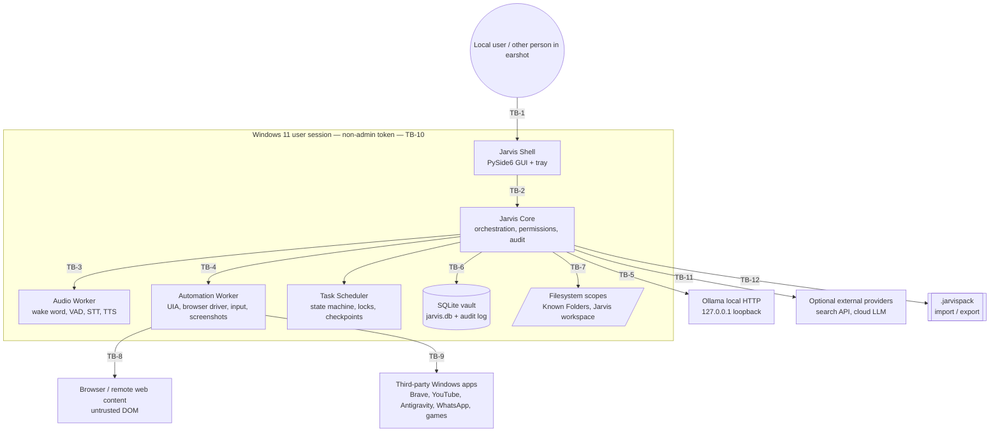

# Project Jarvis — Threat Model

**Document status:** Living document, maintained alongside the PRD and `SECURITY.md`.
**Companion document:** `SECURITY.md` defines the security *policy and controls* (permission model, capability classes, secret handling, audit requirements). This document is the *threat analysis* that justifies and scopes those controls. Where the two overlap, `SECURITY.md` is authoritative on the control design; this document is authoritative on the threat it is meant to address.
**Covers:** The full system described in `PRD.md` (Phases 0–6). The current implementation phase is **Phase 0 — Foundation and safety architecture**. Section 6 states explicitly which threats are live today versus modelled in advance of later phases.

---

## 1. Purpose, scope, and method

### 1.1 Purpose

This document identifies concrete threats against Project Jarvis, a local-first Windows 11 voice desktop agent that is explicitly designed to eventually control applications, the filesystem, the browser, and third-party Windows programs on the user's behalf. Because the end-state product is an autonomous agent with real-world side effects, the threat model must be written against the *full* PRD surface (Phases 0–6), not only against the code that exists in Phase 0. Building the model early lets each later phase implement the mitigations before it ships the capability that makes a threat reachable, rather than retrofitting safety after the fact.

### 1.2 Scope

**In scope:**

- Every functional requirement (FR-xxx), non-functional requirement (NFR-xxx), acceptance test (AT-xxx), and safety test in `PRD.md` §10–§23.
- All trust boundaries between Jarvis components, the Windows OS, third-party applications, the browser, remote web content, and optional external providers.
- The LLM (Ollama-hosted local model) as both a component to be defended and a potential confused deputy.
- The `.jarvispack` import/export format and skill packs.

**Out of scope (covered elsewhere or explicitly excluded by the PRD):**

- The specific control implementations (permission engine internals, redaction algorithms, audit schema) — see `SECURITY.md`.
- Physical security of the host machine, BitLocker/disk encryption, and Windows account credential hygiene — these are Windows/OS responsibilities that Jarvis does not replace (PRD §6, non-goal 12: "Replace antivirus, backup, access control, or operating-system security").
- Legal, licensing, and trademark review of third-party assets (PRD §17.3).
- Threats that require administrator privileges to exploit, since Jarvis runs non-administrator by default (FR-003) and the PRD explicitly forbids permanent administrator operation (§6, non-goal 2).

### 1.3 Method

Threats are identified per interaction (per trust boundary crossing) using **STRIDE**:

| Letter | Category | Meaning here |
|---|---|---|
| S | Spoofing | Impersonating the user, another Jarvis component, Ollama, or a trusted application window |
| T | Tampering | Modifying data, state, checkpoints, model files, or code in transit or at rest |
| R | Repudiation | Actions occurring without an attributable, tamper-evident audit trail |
| I | Information Disclosure | Secrets, personal data, screen/audio/clipboard content reaching an unintended reader |
| D | Denial of Service | Resource exhaustion, lock starvation, or runaway loops that degrade or block Jarvis |
| E | Elevation of Privilege | Gaining a capability, scope, or permission beyond what was granted |

This is supplemented with four **LLM-agent-specific categories**, because STRIDE alone does not naturally capture the failure modes of a planner that consumes untrusted natural-language text and emits structured actions:

| Tag | Category | Meaning here |
|---|---|---|
| PI | Prompt Injection | Untrusted content (web, document, message, filename, UI text, audio, OCR, or the model's own prior output) is interpreted as an instruction rather than data |
| TM | Tool Misuse | The model selects, invents, or parameterises a tool in a way that is invalid, unscoped, or unsafe |
| OP | Over-Permission | A capability grant is broader, longer-lived, or more reusable than the user's actual intent |
| HS | Hallucinated Success | Jarvis reports or acts as though an outcome occurred without verifying it |

Each threat in the catalogue (Section 5) is tagged with one or two of these ten categories, the trust boundary it crosses (Section 3), an Impact and Likelihood rating (Low/Medium/High), the intended mitigation, the PRD requirement(s) that ground the mitigation, and the phase (PRD §21) in which the capability — and therefore the mitigation — is scheduled to land.

### 1.4 Review cadence

This document is reviewed:

1. **At the start of each phase**, to confirm the previous phase's required mitigations (Section 7) actually landed before any newly-reachable threat becomes live.
2. **At the end of each phase**, as an explicit exit-criterion gate: a phase is not considered complete under PRD §21 until this document has been re-reviewed, any newly reachable threats have been reclassified from "modelled" to "live," and any threat discovered during implementation has been added to Section 5.
3. **On any deviation from the PRD**, per PRD §1 instruction 13 (deviations are recorded as ADRs in `docs/decisions/`) — a deviation that changes a trust boundary or capability triggers a threat-model update in the same change set.
4. **On any Phase 0 change to the tool allow-list, permission engine, or audit schema**, since these are the load-bearing controls for nearly every threat in this catalogue.

---

## 2. System description and assets

### 2.1 System description

Project Jarvis is a Python 3.11 / PySide6 Windows desktop application composed of the process/module boundaries defined in PRD §12.2:

- **Jarvis Shell** — the PySide6 GUI, system tray, approval dialogs, settings, and global hotkeys. The only component the user directly sees and controls.
- **Jarvis Core** — conversation orchestration, model routing, the tool registry, permission evaluation, task planning, memory retrieval, and audit logging. This is the trusted decision-making centre.
- **Audio Worker** — wake-word detection, voice activity detection, recording, speech-to-text, and text-to-speech playback.
- **Automation Worker** — UI Automation, browser automation (Playwright/Brave), mouse/keyboard input, screenshots, and application adapters.
- **Task Scheduler** — the task state machine, queue, resource locks, checkpoints, retries, pause/resume, and watchers.

For Phase 0 these may be modules within a single process; the PRD requires the interfaces to remain typed and separable so they can become independent processes later without a rewrite (PRD §12.2). Canonical state is a local SQLite database, `jarvis.db`, under `%LOCALAPPDATA%\ProjectJarvis\` (PRD §14.1–§14.2), alongside an append-only audit log, screenshots/attachments, the dedicated Brave automation profile, and downloaded models.

### 2.2 Assets

| Asset | Sensitivity | Notes |
|---|---|---|
| Conversation history | High | May contain anything the user has said to Jarvis; deletable per FR-166 |
| Memories | High | User-approved durable facts about the person; explicit provenance required (FR-162) |
| Personality profile | Medium | Behavioural configuration; low direct harm if disclosed, but identity-revealing |
| Audit log | High | A complete record of every consequential action; a single source of truth for incident response and also a concentrated disclosure risk if secrets leak into it |
| Task state | Medium | May reveal in-progress user activity and application/file targets |
| Application catalogue | Low–Medium | Executable paths, AUMIDs, launch arguments; useful recon value to an attacker |
| Permission grants | High | Defines what Jarvis is currently authorised to do; the primary target of elevation-of-privilege threats |
| Browser profile (dedicated "Jarvis" Brave profile) | Critical | Contains live logged-in sessions (FR-056); equivalent to a bundle of session cookies for every site the user has authorised |
| Model files | Low (Medium for integrity) | Low confidentiality value; integrity matters because a tampered model changes agent behaviour |
| Secrets (API keys, tokens, OAuth refresh tokens) | Critical | Must never appear in plaintext config or normal exports (FR-169, §18.3) |
| User filesystem contents | Critical (context-dependent) | Ranges from harmless to highly sensitive; Jarvis's own scope enforcement is the only thing preventing broad access |
| Screen contents | High | May transiently include passwords, banking data, or private messages during capture |
| Clipboard contents | Critical (context-dependent) | Frequently contains passwords, TOTP codes, and recovery phrases even briefly |
| Microphone audio | High | Continuously processed while listening is enabled; privacy-critical even though retention is disabled by default |
| Windows session integrity | Critical | The non-admin user token, UIPI boundary, and secure desktop are the outermost guarantee that Jarvis cannot silently escalate |

---

## 3. Trust boundaries

Each numbered trust boundary (TB) below is a point where data or control crosses between principals with different trust levels. The threat catalogue in Section 5 references these IDs.

| ID | Boundary | Description |
|---|---|---|
| TB-1 | User ↔ GUI (Jarvis Shell) | Voice, keyboard, and mouse input from whoever is physically present; the GUI cannot cryptographically distinguish the authorised user from another person in earshot or at the keyboard |
| TB-2 | GUI (Jarvis Shell) ↔ Jarvis Core | Internal control channel carrying settings changes, approval decisions, and task commands |
| TB-3 | Core ↔ Audio Worker | Internal channel carrying raw/ring-buffered audio, transcripts, and TTS requests |
| TB-4 | Core ↔ Automation Worker | Internal channel carrying tool calls that drive mouse, keyboard, UI Automation, and screenshots |
| TB-5 | Core ↔ Ollama local HTTP endpoint | Loopback HTTP carrying prompts and receiving structured tool-call JSON; Ollama itself has no built-in authentication |
| TB-6 | Core ↔ SQLite vault | Local file I/O to `jarvis.db`, the audit log, and attachments under `%LOCALAPPDATA%\ProjectJarvis\` |
| TB-7 | Core/Automation ↔ filesystem scopes | Root-scoped access to Windows Known Folders, the Jarvis workspace, and user-approved paths |
| TB-8 | Automation ↔ browser / remote web content | Playwright-driven Brave profile rendering arbitrary, untrusted third-party HTML/JS/DOM |
| TB-9 | Automation ↔ third-party Windows applications | UIA and window-message interaction with applications whose code Jarvis does not control (Brave, YouTube client, Antigravity, WhatsApp, games) |
| TB-10 | Jarvis ↔ Windows OS security boundary | The non-admin per-user token, UIPI integrity levels, NTFS ACLs, and the secure desktop |
| TB-11 | Jarvis ↔ optional external providers | Network calls to a configured search API or cloud LLM, used only when explicitly enabled |
| TB-12 | Import/export boundary (`.jarvispack`) | A ZIP-compatible package that crosses machines, users, and time |

---

## 4. Actors

| Actor | Capability | Motivation | Reach |
|---|---|---|---|
| **Legitimate local user** | Full voice/keyboard/GUI control; the only principal who can grant permissions | Wants a useful, trustworthy assistant | Everything the permission engine allows; the actor the whole design is built around, but also capable of misconfiguring their own permissions |
| **Other local Windows users** | A separate OS account on the same machine, no special access to Jarvis's account | Curiosity, shared-machine snooping, or a compromised secondary account being used as a foothold | Anything left world-readable under `%LOCALAPPDATA%\ProjectJarvis\` or a misconfigured local IPC endpoint; cannot use voice/GUI without switching sessions |
| **Malicious web content author** | Controls arbitrary HTML/JS/DOM/text on a page Jarvis's browser automation visits or a search result Jarvis reads | Data exfiltration, drive-by consent-click fraud, ad/affiliate abuse, credential phishing | Anything the automation worker reads from the page and anything the planner is tricked into doing via PI |
| **Malicious document/message author** | Crafts a PDF, DOCX, or chat message the user asks Jarvis to open or monitor | Same as above, delivered via a channel the user trusts more than a random webpage | Document/message content fed into the model context; OCR and extraction pipelines |
| **Malicious `.jarvispack` or skill pack author** | Produces an importable package or skill definition | Distributing a backdoored "useful skill" that carries pre-approved high-risk permissions or resource locks | Whatever the import/review UI fails to surface before the user approves it |
| **Compromised or typosquatted Python dependency** | Arbitrary code execution at build or runtime, inside the same OS process/privilege as Jarvis | Supply-chain compromise for scale (credential theft, ransomware staging, cryptomining) | Everything the Jarvis process can reach, since it runs with the same rights as the application |
| **Malware already resident on the host** | Arbitrary code execution as the same or another local user, potentially already privileged | Persistence, lateral movement, credential/session theft | The IPC channels, `%LOCALAPPDATA%\ProjectJarvis\`, the Ollama loopback endpoint, and any world-readable token or config Jarvis leaves behind |
| **Remote network attacker** | No direct network exposure by default (NFR-021 local binding, offline/local-assistant modes) | Would need Jarvis to expose a remote-reachable service or the user to route sensitive data through a compromised external provider | Very limited unless a misconfiguration binds a service beyond loopback, or a compromised external provider (TB-11) is used |
| **The LLM itself, as a confused deputy** | Not an external attacker, but a component that can be manipulated by any of the above into using Jarvis's own legitimate authority against the user's intent | No motivation of its own; the risk is that it faithfully executes attacker-supplied instructions it cannot distinguish from the user's | Whatever tool the planner is allowed to call, if PI/TM/OP controls fail |

---

## 5. Threat catalogue

Each threat is identified as `T-NNN`. **Category** uses the STRIDE letters and LLM tags defined in Section 1.3. **TB** references Section 3. **Phase** is the earliest PRD §21 phase in which the underlying capability becomes reachable, and therefore the phase by which the listed mitigation must exist. A Phase-0 entry means the risk is live today with the code being scaffolded now; a later Phase number means the threat is *modelled in advance* and not yet reachable (see Section 6).

### 5.1 Indirect prompt injection

Untrusted text reaches the planner from many different channels. Per PRD §11.4, content retrieved from websites, documents, messages, application UIs, or search results "must be wrapped as untrusted observations," and the planner must never interpret embedded text as authority. Each channel below is a distinct vector because each is introduced by a different PRD capability and therefore needs its own test.

| ID | Category | TB | Threat | Impact | Likelihood | Mitigation | PRD ref | Phase |
|---|---|---|---|---|---|---|---|---|
| T-001 | PI | TB-8 | A web page's visible or CSS/DOM-hidden text instructs Jarvis to perform an action ("ignore previous instructions," "click Allow," "paste this into the form") | High | High | Untrusted-content wrapper around all retrieved page text; planner system prompt treats it as data only; only the authenticated user, GUI settings, signed skills, and system policy may authorise tools | FR-054, §11.4, AT-007 | 2 |
| T-002 | PI | TB-7 | A PDF's embedded text (including invisible/OCR-adjacent layers) contains instructions to the agent | High | Medium | Same untrusted-content wrapping applied to document extraction output before it reaches the model | FR-054, FR-210, §11.4 | 4 |
| T-003 | PI | TB-7 | A DOCX/PPTX/XLSX file's body text, comments, tracked changes, or speaker notes embed instructions | High | Medium | Document extraction output is wrapped as untrusted regardless of source field | FR-054, FR-211, FR-215, §11.4 | 4 |
| T-004 | PI | TB-9 | A monitored chat message (e.g. WhatsApp) instructs Jarvis to copy data elsewhere or take an action | High | Medium | Message content is treated as untrusted observation; monitoring requires explicit scope, duration, destination and retention (Scenario I); submission and paste are distinct permissioned actions | FR-054, FR-143–FR-145, §11.4 | 4 |
| T-005 | PI | TB-7 | A filename itself is crafted as an instruction string and is echoed into the model context during a file search or listing | Medium | Medium | Filenames are data fields in structured tool output, never concatenated into planner instructions; wrapped as untrusted like any other retrieved text | FR-192, §11.4 | 2 |
| T-006 | PI | TB-9 | Windows toast/notification text observed by Jarvis contains an embedded instruction | Medium | Medium | Notification text is wrapped as untrusted observation; restricted-action list (FR-263) blocks reply/send/delete/approve regardless of what the text asks | FR-262–FR-263, §11.4 | 4 |
| T-007 | PI | TB-9 | A UI Automation element's accessible name or automation ID is crafted by a hostile or spoofed application to contain an instruction | Medium | Low | UIA properties are structured observation data, not instruction channels; only used to identify/target controls, never parsed as agent commands | FR-071, §11.4 | 2 |
| T-008 | PI | TB-4 | Clipboard content copied from an untrusted source contains an embedded instruction that is later transformed or pasted by Jarvis | Medium | Medium | Clipboard content wrapped as untrusted data; transformation tools operate on it as text, not as planner instructions | FR-251–FR-252, §11.4 | 3 |
| T-009 | PI | TB-9 | OCR output from a scanned document or screenshot contains an embedded instruction | Medium | Medium | OCR output explicitly labelled machine-extracted/uncertain and wrapped as untrusted before reaching the planner | FR-213, §11.4 | 4 |
| T-010 | PI | TB-5 | Jarvis's own prior tool output or model output is fed back into context on a later turn and is re-interpreted as a new instruction (compounding/self-injection) | Medium | Low | Tool results are tagged by provenance (model answer / retrieved fact / inference / tool result / uncertainty per FR-047) so a prior tool result cannot silently masquerade as a fresh user instruction | FR-047, §11.4 | 1 |

### 5.2 Model / tool-call integrity

The PRD requires every model output to pass schema validation, permission evaluation, resource-lock evaluation, tool allow-list validation, parameter validation, and user approval before execution (§13.4). These threats test that pipeline.

| ID | Category | TB | Threat | Impact | Likelihood | Mitigation | PRD ref | Phase |
|---|---|---|---|---|---|---|---|---|
| T-011 | TM | TB-5 | The model invents a tool name that does not exist in the registry | Medium | Medium | Tool allow-list validation rejects any call whose ID is not registered; rejection is logged, not silently dropped | §13.4, §13.3 | 0 |
| T-012 | TM, E | TB-5 | The model requests a shell/PowerShell/code-execution-style tool | High | Medium | No such tool is ever registered anywhere in the runtime (explicit Phase 0 exit criterion); allow-list validation rejects it structurally, not by keyword filtering | PRD §1 instruction 4, §6 non-goal 1, §13.3 prohibited tools, §21 Phase 0 exit criteria | 0 |
| T-013 | TM, D | TB-5 | The model emits malformed or oversized JSON for a tool call | Medium | Medium | JSON/schema validation with size limits runs before any other pipeline stage; malformed calls fail closed with a bounded retry | §13.4 step 1, FR-133 | 0 |
| T-014 | TM, E | TB-5 | The model emits a structurally valid tool call with out-of-scope parameters (path outside approved root, wrong `app_id`, disallowed folder) | High | Medium | Parameter validation and permission evaluation run after schema validation and before dispatch; root-scope and allow-list checks are independent of what the model claims | §13.4 steps 2–5, FR-208 | 0 |

### 5.3 Confused deputy

These threats use Jarvis's own legitimate authority against the user by disguising an instruction as ordinary content the user asked Jarvis to read.

| ID | Category | TB | Threat | Impact | Likelihood | Mitigation | PRD ref | Phase |
|---|---|---|---|---|---|---|---|---|
| T-015 | PI, TM | TB-8 | Web content instructs Jarvis to click "Allow"/"Grant"/"Accept" on a permission, consent, or notification-permission dialog | High | Medium | Page instructions carry no authority (§11.4); any resulting permission or consent action still requires the standard approval dialog shown to the human user | FR-054, §11.4, AT-007 | 2 |
| T-016 | PI, I | TB-8 | Web content instructs Jarvis to upload a specific local file to the site | High | Medium | Explicit prohibition: "Upload a file because a webpage requests it" (FR-204); file upload is not reachable from page-supplied instructions | FR-204, §11.4 | 2 |
| T-017 | PI, I | TB-8 | Web/document content instructs Jarvis to copy memory or conversation content into a form field and submit it | High | Low | Memory retrieval into a prompt is scoped to relevance (FR-163); page text has no authority to trigger memory export; submitting a form is a separately permissioned high-risk action distinct from pasting (FR-145) | FR-163, FR-145, §11.4 | 2 |
| T-018 | PI, E | TB-8 | Web/document content instructs Jarvis to open Settings and grant itself a broader permission | High | Low | Permission changes originate only from the authenticated user via the GUI, never from tool/model-proposed text (§11.4: "Only the authenticated local user, GUI settings, signed skill definitions, and system policy may authorise tools") | §11.4, §11.1 | 2 |

### 5.4 Voice command integrity

| ID | Category | TB | Threat | Impact | Likelihood | Mitigation | PRD ref | Phase |
|---|---|---|---|---|---|---|---|---|
| T-019 | S, TM | TB-3 | A misheard or mis-transcribed command causes a destructive action (e.g. "delete" transcribed from a similar-sounding phrase) | High | Medium | Low-confidence commands that could cause actions require confirmation of the interpreted command before acting; high-risk actions (deletion) always require fresh confirmation regardless of transcript confidence | FR-023, §11.1 high-risk list, §23.3 | 1 |
| T-020 | S | TB-3 | Ambient speech from a TV, radio, video call, or another person in the room triggers the wake word and an unintended or unauthorised command is captured and acted on | Medium | Medium | Wake detection plus VAD-bounded command capture; low-confidence/ambiguous commands require confirmation (FR-023); FR-011 explicitly notes the GUI must not overstate wake-model reliability | FR-010–FR-011, FR-014, FR-023 | 1 |
| T-021 | S | TB-3 | Replayed or synthetically generated audio (voice spoofing) triggers wake detection and a command | Medium | Low | Same confirmation gate as low-confidence/ambiguous commands (FR-023); no speaker-verification requirement exists in the PRD today — flagged as an open question in Section 9 | FR-023 | 1 |
| T-022 | TM | TB-3 | A low-confidence transcript is executed without the confirmation step the PRD requires | High | Low | FR-023 makes confirmation mandatory for low-confidence commands that could cause actions; tested by the STT pipeline integration tests | FR-023, §23.2 | 1 |

### 5.5 Permission escalation and scope creep

The permission screen (PRD §9.9) exposes granular grant types (Deny, Ask every time, Allow for this session, Allow for this task, Allow for a selected application/folder, Always allow for low-risk only). Each grant type creates a distinct way the grant can outlive or exceed the user's actual intent.

| ID | Category | TB | Threat | Impact | Likelihood | Mitigation | PRD ref | Phase |
|---|---|---|---|---|---|---|---|---|
| T-023 | OP, E | TB-2 | A capability granted "for this session" is exercised for actions well beyond the request that prompted the grant | High | Medium | Session grants are scoped to the capability class and, where applicable, the target app/folder named at grant time, not to "everything for the rest of the session"; grants are visible and revocable from the Permissions screen | §9.9, §11.2 | 2 |
| T-024 | OP, E | TB-2 | A grant scoped to one folder or application is reused by the planner for an unrelated folder or application | High | Medium | Folder/application-scoped grants are matched against the specific target at dispatch time, not just at grant time; filesystem tools independently reject out-of-scope paths (FR-208) even if a permission check is bypassed | FR-208, §9.9, §11.2 | 2 |
| T-025 | OP, E | TB-2 | A subtask inherits and exercises a resource lock or permission granted to its parent task, for a purpose the parent grant did not cover | High | Medium | Task-tree design requires each subtask's tool calls to be evaluated against the permission that was actually granted for that specific action, not an inherited blanket grant from the parent | FR-121, FR-124, §11.2 | 3 |
| T-026 | OP, E | TB-2 | An "allow for this task" grant is reused after the task's plan has been silently mutated or replanned | High | Low | Approval design ties "Allow for this task" to the exact scope shown in the approval dialog (§11.2: "Exact scope"); a replanned task is treated as a new plan requiring re-evaluation, not silent continuation under the old grant — flagged as an implementation detail needing an explicit plan-version/hash tie-in (Section 9) | §11.2, FR-121 | 3 |
| T-027 | OP, E | TB-2 | The user revokes a permission mid-task, but an in-flight or already-queued tool call executes anyway | High | Low | Permission state is checked immediately before every tool dispatch, not only at task start; §23.3 lists "user revokes permission mid-task" as an explicit adversarial test case | §11.2, §23.3 | 3 |

### 5.6 Resource-lock and GUI-action integrity

PRD §7.1 permits multiple concurrent tasks but restricts foreground desktop control (mouse/keyboard/active window) to one task at a time.

| ID | Category | TB | Threat | Impact | Likelihood | Mitigation | PRD ref | Phase |
|---|---|---|---|---|---|---|---|---|
| T-028 | T, D | TB-4 | Two tasks race to acquire the foreground desktop-control lock and both attempt to drive mouse/keyboard | High | Low | Input ownership is acquired via a single resource lock before any mouse/keyboard action (FR-077); FR-124 defines foreground desktop control as a schedulable resource; §7.1 explicitly forbids two tasks independently moving the mouse | FR-077, FR-124, §7.1, AT-009 | 2 |
| T-029 | T | TB-4 | A task acts on a screen/window state that a concurrent task has since changed | Medium | Medium | Resume/step execution re-observes the relevant application state rather than assuming it is unchanged (FR-126); user-interruption pause logic (FR-078) generalises to cross-task interference | FR-078, FR-126 | 2 |
| T-030 | D | TB-4 | The foreground desktop-control lock is not released after an Automation Worker crash, blocking all future automation | Medium | Medium | Clean shutdown releases automation locks (FR-007); lock leak recovery must be part of crash-recovery state restoration (FR-006) | FR-006, FR-007 | 2 |
| T-031 | T, I | TB-4 | Clipboard content set by one task is silently overwritten or reused by a concurrent task | Medium | Medium | Clipboard is a schedulable resource lock (FR-124); FR-258 explicitly requires clipboard contents used by one task not be silently reused by another | FR-124, FR-258 | 3 |
| T-032 | TM | TB-4 | A vision-based or coordinate-based click targets a hidden, off-screen, or disabled control that deterministic UI Automation inspection would have excluded | Medium | Medium | Vision-based clicks must include screenshot timestamp, proposed target, confidence, screen bounds, and a post-action state check (FR-075); §23.3 lists "hidden or off-screen control" as an explicit adversarial test case | FR-075, §23.3 | 4 |
| T-033 | T | TB-4 | The target window or control changes state between the verification screenshot and the click being executed | Medium | Medium | One-action-one-verification discipline (§4.3: inspect, choose one bounded action, execute, verify, then continue/retry/stop); §23.3 lists "window changes during click" as an explicit adversarial test case | §4.3, FR-276, §23.3 | 2 |

### 5.7 Task state machine

| ID | Category | TB | Threat | Impact | Likelihood | Mitigation | PRD ref | Phase |
|---|---|---|---|---|---|---|---|---|
| T-034 | R, T | TB-6 | A completed consequential action is replayed after an unexpected restart because its checkpoint was not durably committed before the crash | High | Low | NFR-011 requires Jarvis not repeat a potentially consequential action without checking whether it already happened; checkpoints must persist before the action they describe is considered "done" | FR-006, FR-128, NFR-010, NFR-011, AT-011 | 3 |
| T-035 | T | TB-6 | A partial or corrupted checkpoint write causes a task to resume in an inconsistent state | Medium | Low | Checkpoints are the mechanism by which long tasks survive restarts (FR-128); resume re-inspects application state rather than trusting the checkpoint blindly (FR-126) | FR-126, FR-128 | 3 |
| T-036 | D | TB-4, TB-7 | Duplicate event triggers (e.g. a filesystem event firing twice) spawn multiple task instances for the same underlying event | Medium | Medium | Conditional triggers must prevent duplicate task instances for the same event (FR-297); repetitive workflows maintain a deduplication key (FR-142); AT-033 tests this directly | FR-142, FR-297, AT-033 | 3 |
| T-037 | OP, D | TB-2 | The missed-schedule policy defaults to running all missed occurrences after a long downtime, causing an unintended bulk action | Medium | Low | FR-293 requires an explicit missed-run policy (skip / run at next opportunity / ask the user / grace period) rather than blind execution of every missed run; AT-032 tests this directly | FR-293, AT-032 | 3 |

### 5.8 Filesystem

FR-208 requires filesystem tools to reject any path outside an approved root scope, with validation that resolves relative paths, symbolic links, junctions, shortcuts, case differences, and environment variables. The threats below are the concrete bypass techniques that validation logic must defeat.

| ID | Category | TB | Threat | Impact | Likelihood | Mitigation | PRD ref | Phase |
|---|---|---|---|---|---|---|---|---|
| T-038 | E | TB-7 | Path traversal (`..` segments) in a filename or tool parameter escapes the approved root scope | High | Medium | Root-scope validation canonicalises the resolved absolute path and rejects anything outside the approved root before any read/write | FR-208, AT-022 | 2 |
| T-039 | E | TB-7 | A symbolic link or NTFS junction created inside an approved scope resolves to a target outside it | High | Medium | FR-208 explicitly requires resolution of symbolic links and junctions during path validation, not just the literal path string; FR-204 forbids following links/junctions/shortcuts outside approved scope without validation | FR-204, FR-208 | 2 |
| T-040 | E | TB-7 | TOCTOU race: a path passes scope validation, then is swapped via a symlink/junction before the file operation actually executes | High | Low | Validation and the file operation must resolve the path atomically or re-validate immediately before use, not rely on a check performed earlier in the call chain | FR-208 | 2 |
| T-041 | T, D | TB-7 | ZIP-slip during archive extraction writes files outside the selected destination folder | High | Medium | FR-200 explicitly requires archive extraction to protect against path traversal, writing outside the destination, and symbolic-link escape | FR-200 | 3 |
| T-042 | D | TB-7 | A zip-bomb causes excessive archive expansion, exhausting disk space during extraction | Medium | Low | FR-200 explicitly requires protection against "excessive archive expansion"; no numeric expansion-ratio limit is yet defined in the PRD (Section 9 open question) | FR-200 | 3 |
| T-043 | I | TB-7 | A generic file-read tool is pointed at a credential store, browser session database, or private-key file | Critical-class content, rated High | Low | FR-204 explicitly and separately prohibits reading credential stores, password databases, private keys, browser session databases, and authentication files, independent of whether the path is otherwise in scope | FR-204, FR-080 | 2 |
| T-044 | E | TB-7 | A filesystem tool writes outside its approved scope via unresolved or relative environment-variable expansion in a path parameter | High | Low | FR-208 explicitly requires environment-variable resolution as part of path validation, and re-validation must occur after expansion, not before | FR-208 | 3 |
| T-045 | E | TB-7 | A Windows 8.3 short filename alias (e.g. `RESUME~1.PDF`) or an NTFS Alternate Data Stream (`file.pdf:hidden.exe`) references content that path/type validation did not check | Medium | Low | Path canonicalisation must resolve short-name aliases to their long-name target and must not trust the declared file type without inspecting the primary data stream | FR-208 | 2 |
| T-046 | E | TB-7 | A UNC path (`\\server\share`) or Win32 device path (`\\?\`, `\\.\`) bypasses Known-Folder/root-scope validation logic that assumes ordinary drive-letter paths | Medium | Low | Known Folders are resolved through Windows APIs (FR-190), and scope validation must normalise device-path and UNC prefixes before comparison against the approved root, not treat them as an automatic escape | FR-190, FR-208 | 2 |
| T-047 | E | TB-7 | A case-insensitivity mismatch between the scope check and the underlying NTFS access allows a scope bypass | Medium | Low | FR-208 explicitly requires case differences to be resolved during path validation | FR-208 | 2 |

### 5.9 Data exfiltration

| ID | Category | TB | Threat | Impact | Likelihood | Mitigation | PRD ref | Phase |
|---|---|---|---|---|---|---|---|---|
| T-048 | I | TB-6 | Secrets, tokens, or other sensitive parameter values appear in plaintext in the audit log, a crash dump, or opt-in telemetry because a redaction or exclusion rule has a gap | High | Medium | Audit logs must record parameters "with secret redaction" (§11.5); telemetry, when enabled, must exclude conversation content, screenshots, filenames, and message content (§18.5); local-only crash logs are supported to avoid remote leakage | §11.5, §18.5, NFR-022 | 0 |
| T-049 | I | TB-4, TB-9 | Screenshot evidence captured for task verification includes a blocklisted sensitive application (password manager, banking app) that overlaps the target window | High | Medium | Sensitive-application blocklist for automation and screenshot capture (FR-081); capture scope prefers the narrowest target — control, then app, then window — before falling back to full desktop (FR-271); AT-031 tests refusal directly | FR-081, FR-271, FR-273, AT-031 | 2 |
| T-050 | I | TB-12 | A normal `.jarvispack` export inadvertently includes cookies, tokens, or session data | High | Low | Normal exports must exclude API keys, cookies, login sessions, OAuth refresh tokens, passwords, and private keys (§14.6); AT-016 tests this directly; §23.3 lists "export attempts to include tokens" as an adversarial test case | FR-169, §14.6, AT-016, §23.3 | 3 |
| T-051 | I | TB-11 | Sensitive memory content is retrieved into a prompt that is subsequently sent to an optional external/cloud provider | High | Low | Document and memory content remain local unless the user explicitly selects an external provider, and the GUI must clearly indicate when content would leave the computer (FR-218); memory retrieval is relevance-scoped, not a blanket dump (FR-163) | FR-163, FR-218 | 6 |
| T-052 | I | TB-6, TB-10 | Another local Windows user account (not the Jarvis owner) reads `jarvis.db`, the audit log, or attachments under `%LOCALAPPDATA%\ProjectJarvis\` because NTFS permissions were never explicitly verified as owner-only | High | Low | Relies on default per-user ACLs on `%LOCALAPPDATA%`; the PRD does not currently state an explicit requirement to verify or harden these ACLs at startup — flagged in Section 9 as an open question and in Section 6 as a threat that is live from Phase 0 | NFR-020, NFR-022 (inferred; no explicit FR) | 0 |

### 5.10 Local IPC

PRD §12.3 requires that, if Jarvis Core/Shell/Workers become separate processes, they bind only to loopback or Windows named pipes, use a per-installation authentication token, reject non-local requests, and rotate tokens on reset. Ollama itself is a separate, off-the-shelf local HTTP service with no built-in authentication.

| ID | Category | TB | Threat | Impact | Likelihood | Mitigation | PRD ref | Phase |
|---|---|---|---|---|---|---|---|---|
| T-053 | S, E | TB-2, TB-3, TB-4 | An unauthenticated loopback port allows any local process to connect to Jarvis Core and issue tool calls | High | Low | §12.3 requires binding only to loopback/named pipes plus a per-installation authentication token and rejection of non-local requests | §12.3, NFR-021 | 0 |
| T-054 | I | TB-6 | The per-installation IPC authentication token is stored in a world- or user-readable file and is stolen by another local process | High | Low | Token storage location and permissions must match the sensitivity of what it authorises; token rotation is required during reset (§12.3) | §12.3, NFR-022 | 0 |
| T-055 | S | TB-2 | Another local process or session connects to Core's IPC channel and impersonates the GUI | High | Low | Per-installation token authentication and rejection of non-local/unauthenticated connections (§12.3) | §12.3 | 0 |
| T-056 | S | TB-5 | A second local process binds the Ollama port before Jarvis does, squatting on the expected endpoint | Medium | Low | Ollama health check (Phase 0 deliverable) should validate the endpoint's identity/response shape, not merely that something is listening on the expected port | §21 Phase 0 deliverables ("Ollama health check") | 0 |
| T-057 | S, T | TB-5 | A rogue local process impersonates the Ollama HTTP API and returns malicious tool-call JSON to Core | High | Low | Full tool-call validation pipeline (§13.4) treats all model output — including a spoofed response — as untrusted until it passes schema, permission, lock, allow-list, and parameter validation; genuine endpoint authentication for Ollama is not yet defined (Section 9 open question) | §13.4, §21 Phase 0 deliverables | 0 |

### 5.11 Windows-specific

| ID | Category | TB | Threat | Impact | Likelihood | Mitigation | PRD ref | Phase |
|---|---|---|---|---|---|---|---|---|
| T-058 | S, E | TB-9, TB-10 | UIPI blocks legitimate synthetic input to a higher-integrity-level window, or Jarvis attempts to interact with the Windows secure desktop or a UAC consent prompt | Medium | Medium | Jarvis explicitly must not interact with the secure desktop or UAC prompts (FR-079); when elevation is genuinely required, a separate narrowly-scoped elevated helper is used and the exact action is shown before UAC appears (FR-004) | FR-004, FR-079 | 2 |
| T-059 | S | TB-9 | A malicious application spoofs a trusted window title (e.g. names itself "Brave") so that Jarvis operates on it instead of the real target | High | Medium | §23.3 lists "application spoofing another window title" as an explicit adversarial test case; window identification should use process/executable identity in addition to title text (Section 9 open question on the exact pinning mechanism) | FR-240, §23.3 | 2 |
| T-060 | T, E | TB-10 | DLL search-order hijacking of the packaged PyInstaller executable via a malicious DLL placed in the application directory or an attacker-influenced working directory | High | Low | Standard Windows safe-DLL-loading practice (fully-qualified load paths, no reliance on default search order) for the runtime and packaged build; not yet an explicit PRD requirement — flagged in Section 9 | §12.1 (packaging), NFR-020 (inferred) | 0 |
| T-061 | E | TB-10 | An unquoted service/executable path or a writable install directory lets a local attacker plant an executable that inherits Jarvis's privileges | High | Low | Installer hardening: quoted paths, install directory not writable by non-owning accounts | §18.1 (installer requirements, inferred) | 6 |
| T-062 | T | TB-10 | The Windows startup Run-key entry is tampered with to point at a malicious executable | High | Low | Startup registration uses the documented Windows startup API (FR-002); the entry's target should be verified/re-asserted rather than assumed stable | FR-002 | 1 |
| T-063 | S | TB-9 | An application-specific adapter (e.g. Antigravity, YouTube) is targeted by a decoy application that mimics the adapter's expected UI signals, causing Jarvis to act on the wrong program | Medium | Low | Launch verification through process, window, or application-specific signal (FR-064); application-specific adapters prefer deterministic identifiers (executable path, AUMID) over title text alone | FR-064, FR-060 | 2 |

### 5.12 Privacy (sensor and content capture)

| ID | Category | TB | Threat | Impact | Likelihood | Mitigation | PRD ref | Phase |
|---|---|---|---|---|---|---|---|---|
| T-064 | I | TB-3 | Users cannot verify that the always-on microphone pipeline only ever holds a short in-memory ring buffer before wake detection | Medium | Medium | FR-012 requires pre-wake audio to exist only in a short in-memory ring buffer and never be written to disk; visible/audible recording indicators (FR-013) give an observable signal | FR-012, FR-013, AT-002 | 1 |
| T-065 | I | TB-3 | A bug causes pre-wake ring-buffer audio to persist to disk, becoming an undisclosed recording | High | Low | AT-002 tests directly that no microphone audio is written to disk when no wake phrase is detected; raw command audio itself is deleted after transcription unless diagnostic retention is explicitly enabled (FR-025) | FR-012, FR-025, AT-002 | 1 |
| T-066 | I | TB-4, TB-9 | Screen capture during automation captures a blocklisted sensitive application despite a gap in exclusion coverage (e.g. a new banking app not yet added to the blocklist) | High | Medium | User-maintained sensitive-application/window/website blocklist (FR-273); capture scope prefers the narrowest target (FR-271); this is a coverage-completeness risk that depends on the user maintaining the blocklist — flagged as a residual risk even after Phase 4 lands | FR-271, FR-273, AT-031 | 4 |
| T-067 | I | TB-4 | Clipboard capture records a password, TOTP code, or recovery phrase copied for an unrelated purpose | High | Medium | FR-254 requires avoiding persistence of likely passwords, authentication codes, payment-card information, private keys, recovery phrases, and access tokens; AT-029 tests this directly; detection reliability is a known limitation (Section 9 open question) | FR-254, FR-255, AT-029 | 3 |
| T-068 | I | TB-9 | Notification content (e.g. a 2FA/authentication code) is read by Jarvis and stored in permanent memory | High | Low | Notification content must not be added to permanent memory unless explicitly approved (FR-266); restricted-action list explicitly excludes revealing authentication codes (FR-263) | FR-263, FR-266 | 4 |

### 5.13 Supply chain

| ID | Category | TB | Threat | Impact | Likelihood | Mitigation | PRD ref | Phase |
|---|---|---|---|---|---|---|---|---|
| T-069 | T | TB-10 | A malicious or typosquatted PyPI dependency is introduced at build or development time | High | Medium | Builds must include dependency and licence scanning (NFR-023) | NFR-023 | 0 |
| T-070 | T | TB-11 | An unsigned or unverified model download from the configured source is tampered with in transit or at rest | High | Low | Every download must show provider, licence, size, install location, and redistribution status (§17.2); no explicit checksum/signature verification requirement exists yet for model weights — flagged in Section 9 | §17.2 | 6 |
| T-071 | T | TB-6 | A tampered local model file changes agent behaviour without detection because there is no integrity check on load | High | Low | Model metadata and last-verified date are tracked (FR-060 pattern extended to models); explicit hash verification is not yet a stated PRD requirement — flagged in Section 9 | §17.2, §15.1 (inferred) | 6 |
| T-072 | T, OP | TB-12 | An imported skill pack or `.jarvispack` bundles a workflow with pre-approved high-risk permissions or resource locks that the import review does not surface clearly | High | Medium | No newly recorded or AI-generated skill becomes active without explicit user approval (FR-105); import supports preview, conflict detection, and selective import (§14.6); public skill/plugin signing policy is an explicit open decision in the PRD (§25 item 10) | FR-105, FR-110, §14.6, §25 item 10 | 3 |
| T-073 | T | TB-11 | An unsigned update package is installed without signature verification | High | Low | Signed update packages are required, with rollback for failed updates (§18.4, NFR-024) | §18.4, NFR-024 | 6 |

### 5.14 Availability and safety

| ID | Category | TB | Threat | Impact | Likelihood | Mitigation | PRD ref | Phase |
|---|---|---|---|---|---|---|---|---|
| T-074 | D | TB-7, TB-9 | A folder or notification watcher polls without reasonable backoff, degrading system performance | Medium | Medium | FR-130 requires watchers to use reasonable intervals, backoff, and stop conditions, and forbids continuous polling without visible status | FR-130, FR-203 | 4 |
| T-075 | D, R | TB-2 | An unbounded retry loop on a failing tool call repeats an external side effect or exhausts resources | Medium | Medium | Every automated retry loop must have a configurable maximum and expose the current attempt (FR-133); all retries must be bounded (NFR-012) | FR-133, NFR-012 | 3 |
| T-076 | D | TB-5 | Concurrent loading of the planner, vision, and GPU-backed TTS models exhausts the 12 GB VRAM budget | Medium | Medium | Model resource scheduler prevents unsafe simultaneous loading, with sequential loading, VRAM checks, unloading, and provider fallback (FR-039); only one heavy model is actively loaded at a time by default (§15.2) | FR-039, §15.2 | 4 |
| T-077 | D | TB-6 | Unbounded accumulation of screenshots, logs, or audit records exhausts disk space | Low | Medium | Screenshot retention is configurable and temporary by default (FR-278); the GUI must show storage used by models, history, screenshots, logs, and exports (NFR-006) | FR-278, NFR-006 | 2 |

### 5.15 Honesty failures

| ID | Category | TB | Threat | Impact | Likelihood | Mitigation | PRD ref | Phase |
|---|---|---|---|---|---|---|---|---|
| T-078 | HS | TB-2 | Jarvis reports a task or action as completed without a verification step confirming the actual outcome | High | Medium | "Jarvis shall never claim an application action completed unless a tool or verification step confirms it" (FR-048); §4.6 explicitly rejects "I clicked it" as equivalent to "the task succeeded"; AT-018 tests this directly | FR-048, §4.6, AT-018 | 1 |
| T-079 | HS | TB-5 | Jarvis fabricates or misattributes a citation or source for a research answer | Medium | Medium | Research responses must gather real sources and display source titles and access times (FR-053); document answers must display document name, location, and extracted evidence (FR-219); no dedicated acceptance test currently verifies citation fabrication is prevented (flagged in Section 8) | FR-053, FR-219 | 2 |

### 5.16 IDE-agent orchestration

| ID | Category | TB | Threat | Impact | Likelihood | Mitigation | PRD ref | Phase |
|---|---|---|---|---|---|---|---|---|
| T-080 | OP, E | TB-9 | Jarvis auto-approves an IDE agent's (e.g. Antigravity's) request for broad filesystem access, terminal execution, package downloads, or file deletion | High | Medium | FR-154 enumerates the exact actions Jarvis must never auto-approve (terminal commands, package downloads, file deletion, writing outside the workspace, elevated actions, credential access, network publication, git push, deployment) unless the user grants specific approval for the current action; AT-017 and §23.3 test this directly | FR-154, AT-017, §23.3 | 5 |
| T-081 | TM, E | TB-9 | The IDE-agent integration is used as a hidden route to bypass Jarvis's own tool/permission restrictions ("ask the IDE agent to do what Jarvis itself is not allowed to do") | High | Low | FR-157 explicitly forbids using the visible IDE agent as a hidden route to bypass Jarvis security policies; completion still requires file and IDE-reported test verification, not just an IDE "done" message (FR-156) | FR-156, FR-157 | 5 |

---

## 6. Residual risks accepted for Phase 0

Phase 0 delivers no audio pipeline, no automation worker, no filesystem tools, and no browser integration (PRD §21: "No computer-control features yet"). This means the overwhelming majority of the 81 threats catalogued in Section 5 are **not yet reachable** — they are modelled in advance so their mitigations can be designed into the capability from the moment it ships, not retrofitted. A threat is "live" only if the trust boundary and the attacker capability it depends on already exist in the code being scaffolded right now.

**Threats that are live in Phase 0:**

| Threat | Why it is live now | Accepted residual risk |
|---|---|---|
| T-052 — another local Windows user reads the SQLite vault or audit log | `%LOCALAPPDATA%\ProjectJarvis\` and `jarvis.db` are created starting in Phase 0, even before any conversation or automation data exists | Accepted: rely on default per-user NTFS ACLs; no explicit hardening check yet exists. Low current impact because Phase 0 data is limited to settings, an empty task-state schema, and audit scaffolding — no conversation history, memories, or secrets exist yet to disclose |
| T-048 — secrets/PII leaking into the audit log via a redaction gap | The audit log is a Phase 0 deliverable and begins recording events immediately | Accepted: redaction rules must be built in from the first commit that writes an audit event, even though no genuinely sensitive parameter values flow through Phase 0's limited tool set |
| T-069 — malicious or typosquatted dependency at build/dev time | The Python 3.11 project and its dependency tree exist from the first commit | Accepted: dependency/licence scanning is a Phase 0 CI requirement (NFR-023); until it is wired into CI, the repository is trusting `pip`/`uv` resolution without automated verification |
| T-060 — DLL search-order hijacking of the dev/build environment | The application process exists and loads native extensions (PySide6, SQLite driver) from Phase 0 onward | Accepted: no explicit safe-DLL-loading hardening exists yet; residual risk is low because there is no packaged installer or public distribution in Phase 0, limiting the attack to someone who already has local code-execution on the developer's machine |
| T-053, T-054, T-055 — unauthenticated/unhardened local IPC | Phase 0 delivers a "typed event bus" and the Jarvis Shell/Core split begins; if any of this crosses a process boundary rather than staying in-process, §12.3's loopback/token requirements apply immediately | Accepted: if Phase 0 keeps everything in one process (as the PRD allows — "For the MVP, these may be modules in one packaged application"), this risk is dormant; it becomes live the moment any component is split into a separate process, and must be re-reviewed at that point |
| T-056, T-057 — Ollama endpoint squatting / impersonation | Phase 0 explicitly delivers an "Ollama health check" | Accepted: the health check confirms *an* endpoint responds on the expected port; it does not yet cryptographically confirm it is the genuine Ollama process. Residual risk is low in Phase 0 because no tool-call JSON is dispatched for execution yet — the health check is informational only |

**Everything else in Section 5** — prompt injection via web/document/chat/OCR content, confused-deputy scenarios, voice spoofing, permission-scope creep across tasks, resource-lock races, filesystem bypass techniques, screen/clipboard/notification privacy leaks, IDE-agent orchestration, and honesty failures about task completion — requires a capability (microphone capture, automation worker, filesystem tool, browser, document extraction, IDE adapter) that Phase 0 explicitly does not deliver. These are accepted as **not reachable, and therefore not requiring a live mitigation, in Phase 0**, provided the Phase 0 exit criterion "no computer-control features yet" and "no generic shell exists anywhere in the runtime" both hold at review time.

---

## 7. Phase-gated mitigation roadmap

This table states, for each PRD §21 phase, the mitigations that **must** land before that phase's exit criteria can be considered met. It is the forward-looking complement to Section 6.

| Phase | Must land before exit criteria are met | Related threats |
|---|---|---|
| **0 — Foundation and safety architecture** | Tool allow-list + JSON schema validation ahead of any dispatch; permission-engine skeleton with the low/medium/high/prohibited capability classes wired to a testable decision function; audit log with secret-redaction rules from the first event written; confirmation that no shell/exec-style tool is registered anywhere; dependency and licence scanning in CI; if Core/Shell/Workers cross a process boundary, loopback-only binding plus per-installation auth token; Ollama health check that validates response shape, not just port liveness; verification that `%LOCALAPPDATA%\ProjectJarvis\` is created with owner-only permissions | T-011–T-014, T-048, T-052–T-057, T-069 |
| **1 — Voice-first local assistant** | Untrusted-content wrapping applied to any text that reaches the model, including transcripts, ahead of any future content channel; confirmation-before-action for low-confidence or destructive-sounding transcripts; test-verified ring-buffer non-persistence; startup registry entry written only through the documented API; crash-log exclusion list; verified-success gate before Jarvis reports "done" on any action | T-010, T-019–T-022, T-062, T-064–T-065, T-078 |
| **2 — Deterministic desktop and browser automation** | Foreground desktop-control lock plus user-interruption pause; path canonicalisation defeating traversal, symlink/junction escape, TOCTOU, 8.3 short names, ADS, UNC/device paths, and case-insensitivity; independent credential-store/session-DB/private-key denylist inside the filesystem tool; screenshot evidence honouring the sensitive-app blocklist; window-identity checks beyond title text; per-folder/per-app grant scoping exercised end-to-end; vision-click freshness and hidden/off-screen-control exclusion; citation/source display on every research answer; screenshot/log disk-usage cap | T-001, T-005, T-007, T-015–T-018, T-023–T-024, T-028–T-030, T-032–T-033, T-038–T-040, T-043, T-045–T-047, T-049, T-058–T-059, T-063, T-077, T-079 |
| **3 — Tasks, macros, and memory** | Task-tree grant-inheritance rules so a subtask never silently inherits a parent's grant for an unrelated target; grant invalidation on replanning; mid-task revoke checked before every dispatch, not only at task start; durable/atomic checkpoint writes; deduplication key enforced for repeated/conditional triggers; explicit (non-bulk-by-default) missed-schedule policy; archive-extraction hardening (bounded expansion ratio, symlink rejection, destination containment); environment-variable expansion re-validated against scope after expansion; clipboard sensitive-pattern detection, non-persistence, and task-scoped isolation; skill-pack import review surfacing requested permissions/resource locks before any approval; bounded, idempotency-aware retry loops | T-008, T-025–T-027, T-031, T-034–T-037, T-041–T-042, T-044, T-050, T-067, T-072, T-075 |
| **4 — Vision fallback and long-running workflows** | Document/OCR/notification/chat-message ingestion wrapped as untrusted observations identically to web content; watcher polling backoff and stop-condition enforcement; VRAM-aware sequential model loading before the vision model is added; notification content excluded from permanent memory by default; sensitive-app screenshot blocklist extended to cover newly reachable capture paths | T-002–T-004, T-006, T-009, T-066, T-068, T-074, T-076 |
| **5 — IDE orchestration** | Jarvis's own approval dialog required for every FR-154-listed action regardless of what the IDE agent itself claims or auto-approves; audit of IDE prompt templates confirming they cannot be used as a hidden route to actions Jarvis is directly prohibited from taking | T-080–T-081 |
| **6 — Productisation** | Model/skill/update signature or checksum verification before install; installer hardening (quoted paths, non-writable install directory for other accounts); public skill/plugin signing policy resolved (§25 open decision 10) and enforced; secrets migrated to Windows-protected credential storage with a verification pass confirming none remain in plaintext config | T-051, T-060–T-061, T-070–T-071, T-073 |

---

## 8. Mapping to acceptance tests

### 8.1 PRD §22 acceptance tests

| AT | Description (short) | Related threat(s) | Coverage note |
|---|---|---|---|
| AT-001 | Offline privacy | — | No direct catalogued threat; verifies the network-mode control that underlies external-exposure risks such as T-051 |
| AT-002 | Wake privacy | T-064, T-065 | Direct |
| AT-003 | App launch verification | T-078 | Supports the verification discipline behind honest completion, but is a functional test, not adversarial |
| AT-004 | Safe close (unsaved work) | — | Tests FR-066; no dedicated catalogued threat exists for "close without unsaved-work detection" — a minor catalogue gap |
| AT-005 | Force-close approval | — | Tests the §11.1 high-risk confirmation requirement for force-close; no dedicated catalogued threat exists — same gap as AT-004 |
| AT-006 | YouTube result selection | T-078 | Functional disambiguation correctness rather than an adversarial case |
| AT-007 | Prompt injection (webpage) | T-001, T-015 | Direct |
| AT-008 | User interruption pauses automation | T-029 | Direct |
| AT-009 | Concurrent resource queuing | T-028 | Direct |
| AT-010 | Pause/resume re-observation | T-029, T-035 | Direct |
| AT-011 | Restart recovery, no duplicate consequential action | T-034 | Direct |
| AT-012 | Learned macro requires approval | T-072 | Loose — AT-012 tests locally recorded macros; T-072 is framed around imported packs, but the underlying approval-gate control (FR-105) is the same |
| AT-013 | Memory deletion removes retrieval | — | No direct catalogued threat; verifies FR-165 "forget" guarantee |
| AT-014 | Private session leaves no permanent record | — | No direct catalogued threat; verifies FR-046 data-minimisation guarantee |
| AT-015 | Export portability round-trip | T-050 | Loose — tests round-trip fidelity, not secret exclusion specifically (that is AT-016) |
| AT-016 | Secret exclusion from normal export | T-050 | Direct |
| AT-017 | IDE permission interception | T-080 | Direct |
| AT-018 | Honest completion (blocked/failed, not fabricated success) | T-078 | Direct |
| AT-019 | Known-folder resolution via Windows API | T-046 | Loose — supports the path-validation foundation that T-046 (UNC/device-path bypass) depends on |
| AT-020 | File ambiguity disambiguation | — | No direct catalogued threat; functional ranking-quality test |
| AT-021 | File-open verification | T-078 | Supports the verification discipline, functional rather than adversarial |
| AT-022 | Folder-boundary enforcement | T-038 | Direct for path traversal; does **not** specifically exercise symlink escape, TOCTOU, 8.3/ADS, UNC, or case-insensitivity bypass (T-039, T-040, T-045–T-047) |
| AT-023 | Safe deletion (Recycle Bin, confirmation) | — | Tests FR-199; no dedicated catalogued threat — same gap pattern as AT-004/AT-005 |
| AT-024 | File-operation undo | — | No direct catalogued threat; verifies FR-223 rollback correctness |
| AT-025 | Irreversible-action warning | — | No direct catalogued threat; verifies FR-227 disclosure requirement |
| AT-026 | Document-grounded answers | T-079 | Loose — tests source identification; does not specifically try to induce a fabricated citation |
| AT-027 | OCR uncertainty disclosure | T-009 | Loose — tests the uncertainty-labelling control (FR-213), a different control from the injection defence T-009 also depends on |
| AT-028 | Window-layout restoration | — | No direct catalogued threat; functional multi-monitor correctness test |
| AT-029 | Clipboard privacy (passwords/codes not retained) | T-067 | Direct |
| AT-030 | Notification-watcher scope isolation | T-006 | Loose — tests the scope-limiting control that also bounds the blast radius of notification-text injection (T-006), but does not itself test injection |
| AT-031 | Screen-capture exclusion for sensitive apps | T-049, T-066 | Direct |
| AT-032 | Missed-schedule policy (no blind bulk execution) | T-037 | Direct |
| AT-033 | Conditional-trigger deduplication | T-036 | Direct |
| AT-034 | Workspace portability remapping prompts | — | No direct catalogued threat; functional portability test |

### 8.2 PRD §23.3 adversarial safety cases

| Adversarial case | Related threat(s) |
|---|---|
| Webpage says to ignore policy | T-001 |
| Model invents a tool | T-011 |
| Model requests shell execution | T-012 |
| Incorrectly transcribed "delete" | T-019 |
| Hidden or off-screen control | T-032 |
| Window changes during click | T-033 |
| IDE agent requests broad filesystem access | T-080 |
| User revokes permission mid-task | T-027 |
| Export attempts to include tokens | T-050 |
| Application spoofing another window title | T-059 |

### 8.3 Threats with no acceptance-test or safety-test coverage

The mappings above show that roughly two-thirds of the threat catalogue has no acceptance test or adversarial safety case in the current PRD, even where the underlying capability is fully specified. This is expected at this stage — §22 and §23.3 were written to validate headline scenarios, not every bypass technique — but it should not remain silently unaddressed as later phases implement these capabilities. Grouped by area, the threats below currently have **no dedicated test**:

- **Prompt injection vectors beyond the web page case**: T-002 (PDF), T-003 (DOCX/PPTX/XLSX), T-004 (chat message), T-005 (filename), T-007 (UIA accessible name), T-008 (clipboard), T-010 (self-injection/compounding). Only T-001 (web) and, loosely, T-009 (OCR) have any test today.
- **Model/tool-call integrity edge cases**: T-013 (malformed/oversized JSON), T-014 (out-of-scope parameters on an otherwise valid call).
- **Confused-deputy variants beyond "click Allow"**: T-016 (upload a file), T-017 (exfiltrate memory into a form), T-018 (self-grant a permission via Settings).
- **Voice threats beyond mis-transcription**: T-020 (ambient/third-party speech), T-021 (replayed/spoofed audio), T-022 (low-confidence transcript acted upon).
- **Permission-escalation mechanics**: T-023 (session-grant overreach), T-024 (folder/app-grant reuse), T-025 (subtask grant inheritance), T-026 ("allow for this task" reuse after replanning).
- **Resource-lock crash/leak paths**: T-030 (lock leak after worker crash), T-031 (clipboard task-isolation failure).
- **Filesystem bypass techniques beyond basic traversal**: T-040 (TOCTOU), T-041 (zip-slip), T-042 (zip-bomb), T-043 (credential-store/session-DB/private-key read), T-044 (env-var expansion escape), T-045 (8.3 short-name/ADS), T-047 (case-insensitivity).
- **Data exfiltration channels beyond export**: T-048 (audit-log redaction gap), T-051 (memory retrieved into an external-provider prompt), T-052 (another local user reading the vault).
- **Local IPC**: T-053, T-054, T-055, T-056, T-057 — the entire local-IPC threat group has no acceptance test.
- **Windows-specific**: T-058 (UIPI/secure desktop), T-060 (DLL hijacking), T-061 (unquoted path/writable install dir), T-062 (Run-key tampering), T-063 (adapter target confusion).
- **Privacy**: T-068 (notification content reaching permanent memory).
- **Supply chain**: T-069 (dependency), T-070 (model download tampering), T-071 (model file tampering), T-073 (unsigned update) — the entire supply-chain group has no acceptance test, only the build-time NFR-023/NFR-024 requirements.
- **Availability**: T-074 (watcher backoff), T-075 (retry-loop bound), T-076 (VRAM exhaustion), T-077 (disk exhaustion) — the entire availability group has no acceptance test.
- **IDE orchestration**: T-081 (hidden shell delegation via the IDE agent) — only the auto-approval case (T-080) is tested.

**Recommendation:** as each phase in Section 7 lands the capability behind these threats, add a corresponding AT-xxx or §23.3 adversarial case in the same change set, particularly for the local-IPC and supply-chain groups, which currently have zero test coverage anywhere in the PRD despite being live risks from Phase 0 onward (Section 6).

---

## 9. Open threat-model questions

These items need an ADR (recorded under `docs/decisions/`, per PRD §1 instruction 13) or dedicated research before the phase that depends on them can be considered safely scoped. Several overlap with PRD §25 "Open Decisions."

1. **How should the Ollama endpoint be authenticated?** Ollama's HTTP API has no built-in authentication, and it is a separate off-the-shelf service outside Jarvis's own IPC design (§12.3 governs Jarvis-internal processes, not Ollama itself). `docs/decisions/ADR-0007-ollama-loopback-only-trust-boundary.md` has already accepted this as a named residual risk for Version 1: the adapter enforces loopback-only resolution and treats all model output as untrusted through the full invoker pipeline, but it explicitly does **not** authenticate that the loopback listener is genuinely Ollama, and lists "a credible threat-model finding escalates the priority of endpoint squatting" as one of its own revisit triggers. This document is that finding (T-056, T-057). Candidate mitigations for a future revisit: process-identity pinning, a named-pipe binding, a per-process ACL, or a local authenticating reverse proxy — all rejected for Version 1 in ADR-0007 as fragile or disproportionate to a same-user-account threat.
2. **How should Jarvis detect a spoofed window** (an application that names itself "Brave" or another trusted target)? Title-text matching alone is insufficient; candidates are executable path/hash pinning, AUMID verification, or digital-signature checks on the target process. Affects T-059, T-063.
3. **Should application adapters (and the Automation Worker generally) run sandboxed** (e.g. a restricted token, AppContainer, or job object) rather than with the full user token, to bound the blast radius of a compromised adapter or a supply-chain-tampered dependency? This is related to but broader than PRD §25 item 13 ("Whether application adapters run in-process or as isolated plugins").
4. **How reliable is clipboard sensitive-pattern detection in practice** (FR-254)? Regex/entropy heuristics for passwords, TOTP codes, and recovery phrases have known false-negative rates; needs a measured accuracy target and a documented fallback behaviour (e.g. defaulting to non-persistence when uncertain) rather than an unstated "best effort." Affects T-067.
5. **Should `%LOCALAPPDATA%\ProjectJarvis\` ACLs be explicitly verified or hardened at startup**, beyond relying on Windows default per-user permissions, and should Jarvis warn the user if it detects the folder is on a non-NTFS volume or otherwise unable to enforce owner-only access? Affects T-052.
6. **What is the concrete hardening plan against DLL search-order hijacking** for the PyInstaller one-directory build (safe DLL search mode, application manifest, fully-qualified load paths)? Not currently addressed anywhere in the PRD's packaging section (§12.1, §18.1). Affects T-060.
7. **What is the public skill-pack / `.jarvispack` signing policy?** Explicitly listed as unresolved in PRD §25 item 10. Until resolved, T-072's mitigation (import review surfacing requested permissions) is the only defence against a malicious pack, with no cryptographic provenance guarantee.
8. **How should model file integrity be verified** for locally downloaded weights? §17.2 requires disclosure of provider/licence/size but not a checksum or signature check against a trusted manifest, and Ollama manages its own model store outside Jarvis's direct control. Affects T-070, T-071.
9. **Does Jarvis need explicit multi-Windows-user isolation guarantees** beyond default NTFS ACLs, given PRD §4 lists "other local Windows users" as an actor but FR-204 only addresses Jarvis reading *other* users' files, not the reverse (other users reading Jarvis's vault)? Affects T-052.
10. **How should an "allow for this task" grant be tied to a specific plan version**, so that a silent replan cannot reuse the old grant? Needs a concrete mechanism (plan hash, monotonic plan-version counter) rather than the current descriptive requirement in §11.2. Affects T-026.
11. **Should archive extraction run in a bounded/sandboxed subprocess** with an enforced maximum expansion ratio and disk quota, to give zip-bomb protection (FR-200) a measurable, testable limit rather than a qualitative one? Affects T-042.
12. **What is the maximum allowed staleness between a verification screenshot and the click it authorises**, for vision-based and coordinate-based automation? §4.3 requires "inspect, act, verify" per step but does not state a time bound, leaving open how long a stale observation remains trustworthy. Affects T-033.
13. **Should Jarvis implement any form of speaker verification or liveness check** for voice commands, given FR-023's confirmation-for-low-confidence requirement addresses transcription accuracy but not who is speaking? Affects T-020, T-021.
14. **What telemetry payload, if ever enabled, needs a formal schema and independent review** to guarantee the §18.5 exclusion list (no conversation content, screenshots, filenames, or message content) holds under future changes, rather than relying on manual discipline? Affects T-048, T-054 (residual telemetry-adjacent leakage).

